<table style="width:100%">
  <tr>
    <th width="100%" colspan=8><h2>XUP Vitis Labs (2019.2)</h2></th>
  </tr>
  <tr>
    <td align="center"><a href="setup_vitis.md">1. Setup Vitis</a></td>
    <td align="center">2. Introduction to Vitis</a></td>
    <td align="center"><a href="Improving_Performance_lab.md">3. Improving Performance</a></td>
    <td align="center"><a href="Optimization_lab.md">4. Optimization</a></td>
    <td align="center"><a href="rtl_kernel_wizard_lab.md">5. RTL Kernel Wizard</a></td>
    <td align="center"><a href="debug_lab.md">6. Debugging</a></td>
    <td align="center"><a href="Vision_lab.md">7. Vision Application</a></td>
    <td align="center"><a href="PYNQ_lab.md">8. PYNQ Lab</a></td>
  </tr>
</table>

# GUI Flow

## Introduction

This lab guides you through the steps involved in creating a Vitis project using Graphical User Interface (GUI). After creating the project you will run software and hardware emulations to verify the functionality of the design. You will also test the design in hardware on AWS F1 instance using pre-generated and pre-registered bitstream.

Check [Creating a Vitis IDE Project](https://www.xilinx.com/html_docs/xilinx2019_2/vitis_doc/Chunk1843199917.html#cpe1508968036414) to know more about Vitis IDE.


### Description of example application

This lab uses a standard application template available in Vitis. It consists of a C++ host application and a C++ kernel. The C++ kernel is a simple vector addition. The elements of 2 vectors (A & B) are added together, and the result returned in a third array (C). The host application  initializes the two input arrays, send data to the kernel, and read back the result.

You will compile and check a software only version of the application. The *vector add* OpenCL kernel will then be implemented as a hardware kernel. You will first build an emulation version of the design and run a simulation of the hardware kernel. You will then test the application with the kernel running in the FPGA.

## Objectives

After completing this lab, you will learn to:

- Create a project using the Vitis GUI flow
- Run Software Emulation to verify the functionality of a design
- Run Hardware Emulation to verify the functionality of the generated hardware
- Build the system and test it in hardware
- Perform profile and application timeline analysis in hardware emulation

## Steps

### Create a Vitis Project

1. Launch Vitis GUI

    Make sure Vitis and XRT environment has been setup. XRT setup is necessary before launching Vitis because building and running acceleration applications requires XRT. To do so, the following commands should return a valid path.

    ```sh
  	echo $XILINX_VITIS
  	echo $XILINX_XRT
  	```
    If any of the above command fails, then execute the following two commands from `aws-fpga` directory

    ```sh
    cd ~/aws-fpga
    source vitis_setup.sh
    source vitis_runtime_setup.sh
    ```

1. Invoke GUI by executing the following command:

    ```sh
    vitis &
    ```
1. Set workspace to any empty folder, such as `~/workspace` and click **Launch**  

	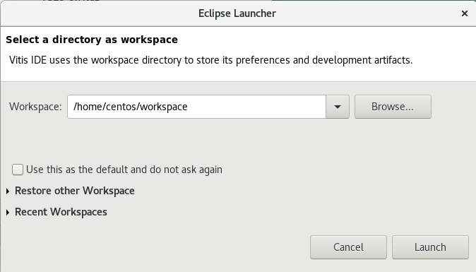

1. The Vitis IDE Welcome page will be displayed, if new a workspace is assigned

	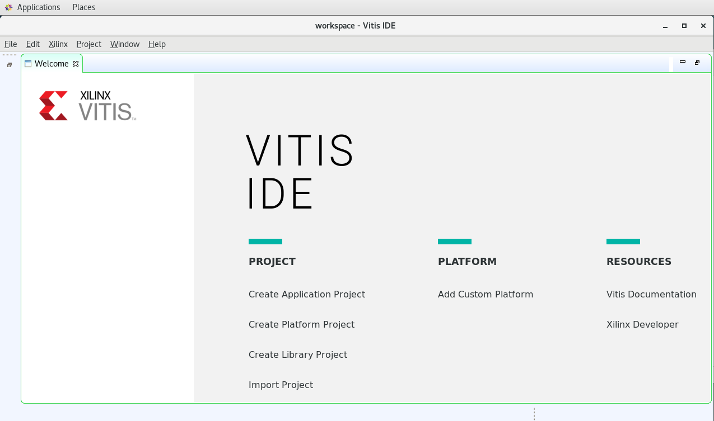

1. Create a new application project

     Use `Create Application Project` from Welcome page, or use `File > New > Application Project` to create a new application.

     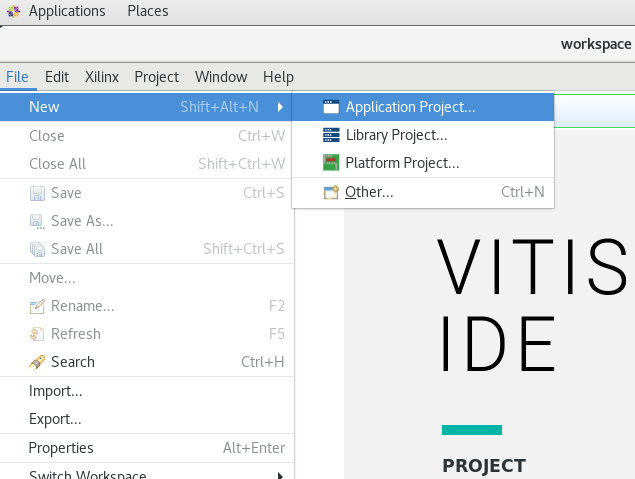

1. Close Welcome page, if it was opened

1. Give a name `vadd` and click **Next>**

	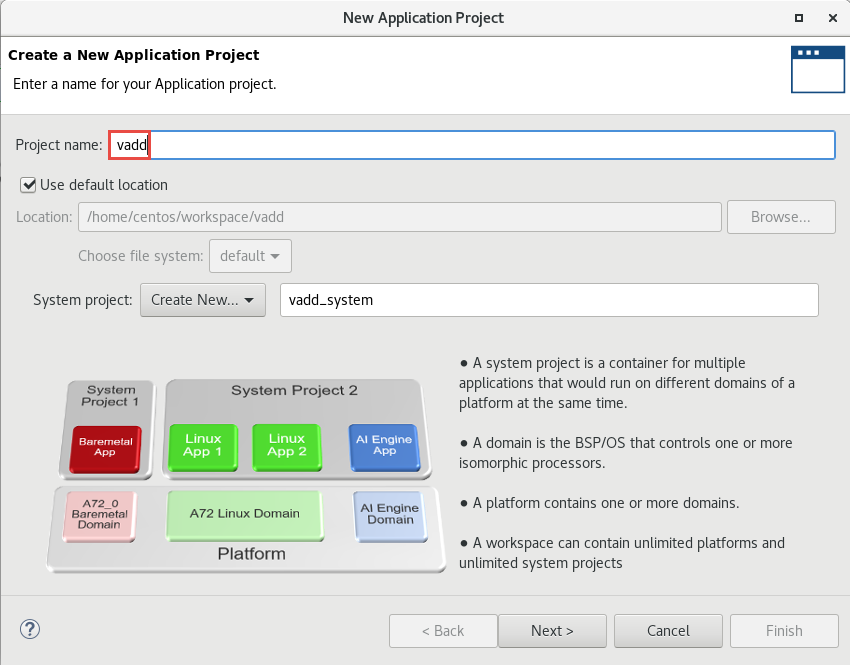

1. You will see one platform, named **xcvc1902_fixed**, for the embedded flow
1. Click on the '+' button and browse to `~/aws-fpga/Vitis/aws_platform`, select `xilinx_aws-vu9p-f1_shell-v04261818_201920_1`, and click **OK**

1. You will see the platform entry, select it and click **Next>**

	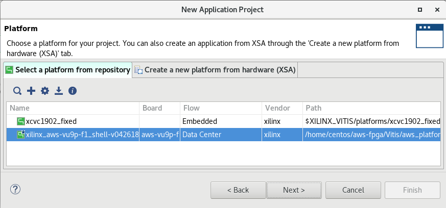

1. Select `Vector Addition`, and click **Finish**

	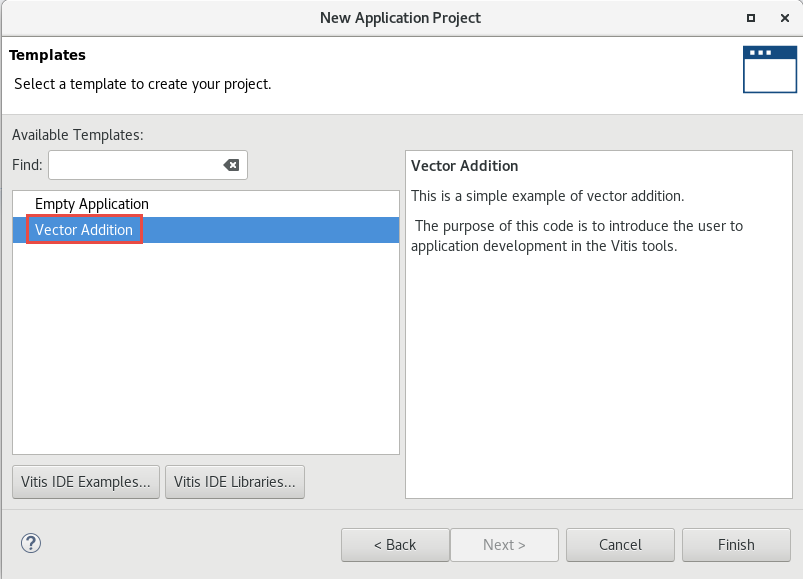

1. The project is generated. Notice that the *Hardware Function* in the *Project Editor* view is automatically set up to *krnl_vadd*

	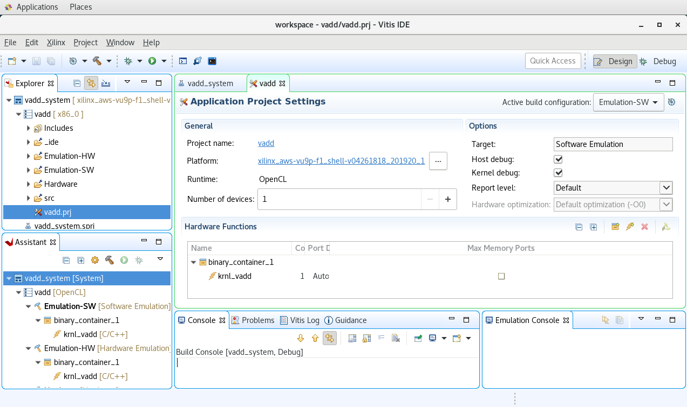

### Build and Run Software Emulation

1. Set `Active build configuration:` to `Emulation-SW` on the upper right corner of *Project Editor* view

1. Begin build by clicking the little hammer icon on top icon bar, or right click `vadd` and select `Build Project`

	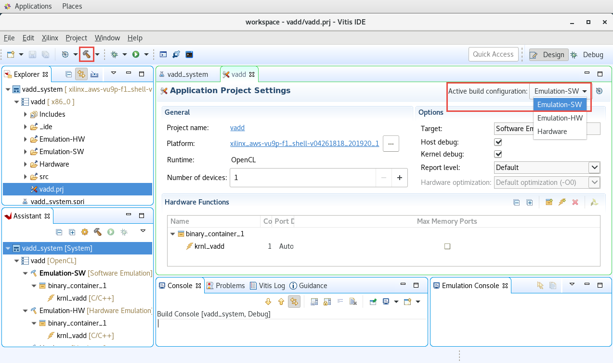

1. Run Software Emulation in GUI Mode

    To launch software emulation in GUI mode, first select the application in *Explorer* view, then click run icon on icon bar, or right click application and select `Run As -> Run Configuration...`

	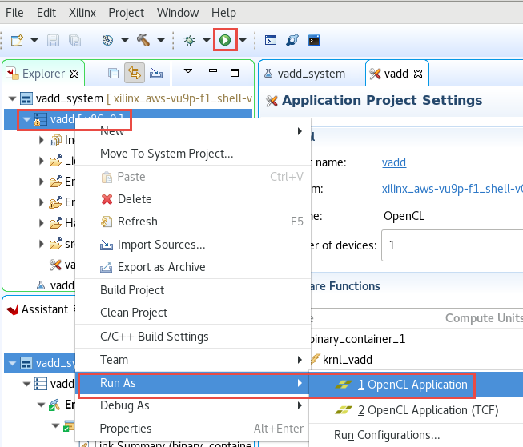

1. Observe the application is run and the output is displayed in the *Console* view

	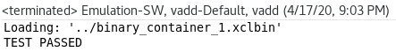

### View Emulation Timeline

1. In the *Assistant* view, double click `Emulation-SW -> vadd-Default -> Run Summary (xclbin)` to open Vitis Analyzer

	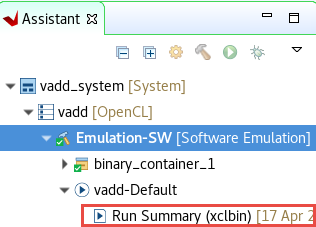

1. Vitis Analyzer shows **Profile Summary** and **Application Timeline** tabs on the left-hand side. Click **Application Timing**
1. Scroll right, click at around 75 ms (you may see different timeline depending on what else was executed earlier), then using mouse button, select the area of interest

    Observe various activities in various regions  

	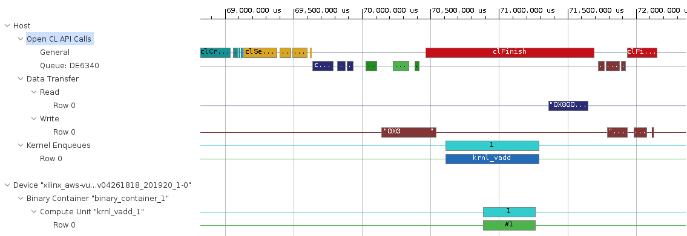

1. When finished, close the analyzer by clicking `File > Exit` and clicking **OK**

### Build and run hardware emulation

1. Set `Active build configuration:` to `Emulation-HW` on the upper right corner of *Project Editor* view

  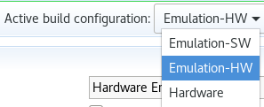

1. Build the project. This may take about 10 minutes

1. Run Hardware Emulation in GUI mode

    To launch hardware emulation in GUI mode, first select the application in *Explorer* view, then click run buttonn on icon bar, or select *Emulation-HW* in *Assistant* view and click on the Run button and select **vadd-Default (OpenCLK APplication)**

	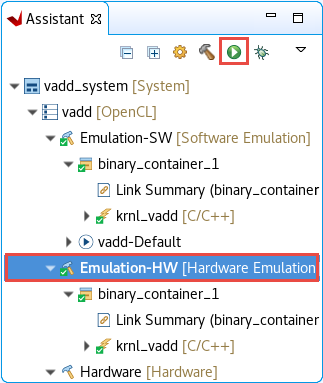

1. Observe the application is run and the output is displayed in the *Console* view. Compared to software emulation, the output also shows data transfer information. Notice the data transfer rate between kernel and global memory is 16 KB on each port

	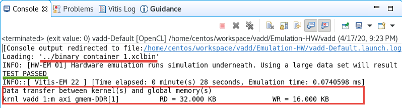

1. View Emulation Timeline

    In the *Assistant* view, double-click `Emulation-HW > vadd-Default > Run Summary (xclbin)` to open Vitis Analyzer

    Vitis Analyzer shows **System Diagram**, **Platform Diagram**, **Run Guidance**, **Profile Summary** and **Application Timeline** tabs on the left-hand side. Click **Application Timeline**. Zoom in between 16 and 30 second area and observe the activities in various parts of the system. Note that the data are processed in smaller chunks in the kernel and in a sequential manner

	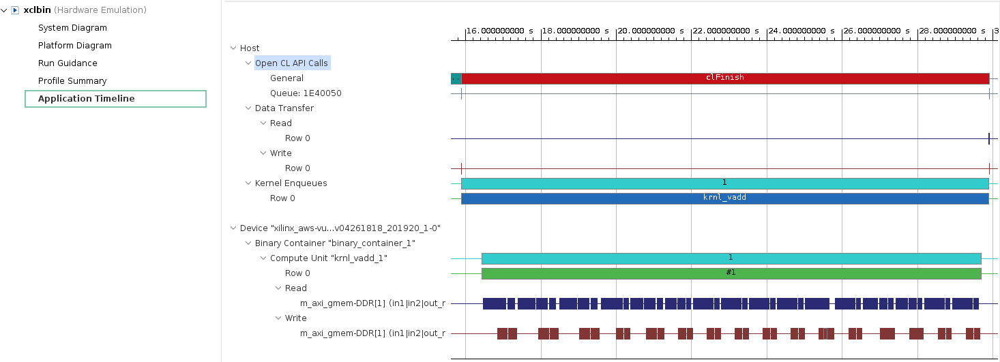

1. Click on the **Profile Summary** entry in the left panel, and observe multi-tab (four tabs) output
    - **Top Operations** : Shows all the major top operations of memory transfer between the host and kernel to global memory, and kernel execution. This allows you to identify throughput bottlenecks when transferring data. Efficient transfer of data to the kernel/host allows for faster execution times
    - **Kernels &amp; Compute Units** : Shows the number of times the kernel was executed. Includes the total, minimum, average, and maximum run times. If the design has multiple compute units, it will show each compute unit's utilization. When accelerating an algorithm, the faster the kernel executes, the higher the throughput which can be achieved. It is best to optimize the kernel to be as fast as it can be with the data it requires
    - **Data Transfers** : This tab has no bearing in software emulation as no actual data transfers are emulated across the host to the platform. In hardware emulation, this shows the throughput and bandwidth of the read/writes to the global memory that the host and kernel share
    - **OpenCL APIs** : Shows all the OpenCL API command executions, how many time each was executed, and how long they take to execute

1. Click on each of tabs and review the report:  

   - Top Operations

	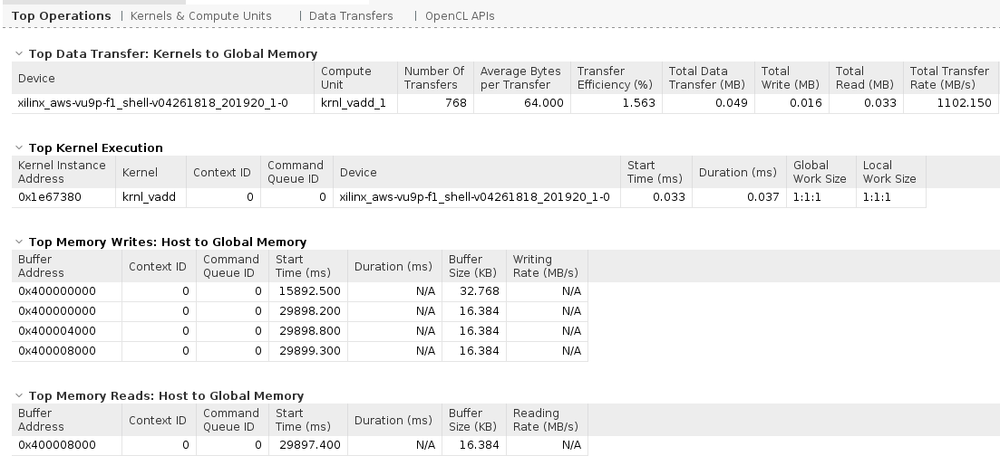

   - Kernels & Compute Units

	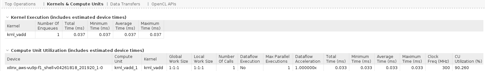

   - Data Transfers

	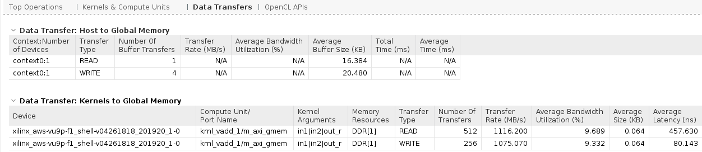

   - OpenCL APIs

	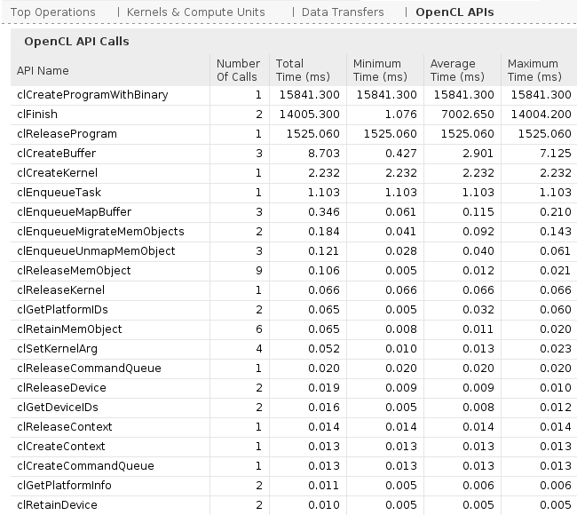

1. When finished, close the analyzer by clicking `File -> Exit` and clicking **OK**

### Build System hardware with profiling and timing analysis options

1. Set `Active build configuration:` to `Hardware` on the upper right corner of *Project Editor* view

	

    In order to collect the profiling data and run Timing Analyzer on the application run in hardware, we need to setup some options.

1. Right-click on Hardware in *Assistant* view and then click on *Settings*

	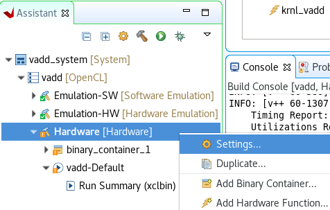

1. Expand Hardware in the left panel to see *binary_container* and *krnl_vadd* entries. Select *krnl_vadd* on the left-hand side, click on the *Data Transfer* drop-down button in krnl_vadd row and select *Counters+Trace* option. Notice that all lower-level entries get the same monitoring options. Similarly, click on *Execute Profiling* check-box in krnl_vadd row. At this point the settings should look like shown below

	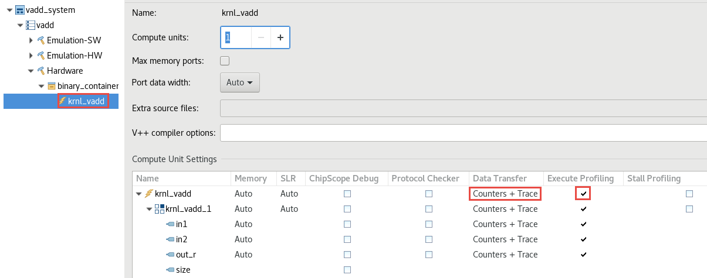

1. Click on *binary_container* on the left-hand side and select *Trace Memory* to be FIFO type and size of 64K. This is the memory where traces will be stored. You have options of storing also in DDR (max limit 2 GB) and PLRAM

1. Click **Apply and Close**

	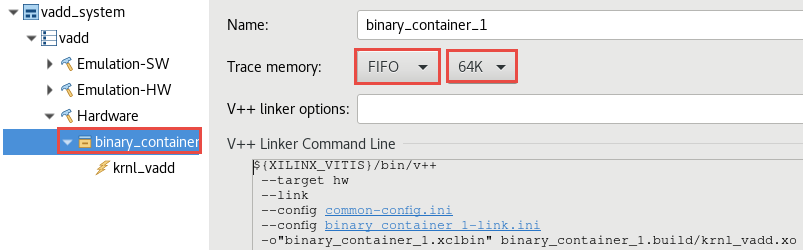

    Normally, you would build the hardware, but since it will take approximately two hours you should **NOT BUILD** it here. Instead used the precompiled solution. See the [Appendix](#appendix-build-full-hardware) below for instructions on how to build the hardware


### Run the Design in target hardware and analyze output

Since the Hardware build and AFI availability takes considerable amount of time, a precompiled and preregistered version is provided. Use the precompiled solution directory to verify the functionality

1. Change to the solution directory by executing the following command

  	```sh
    cd ~/compute_acceleration/solutions/gui_flow
  	```

1. Copy the *binary_container_1.xclbin*, *binary_container_1.awsxclbin*, and *vadd* files into `~/workspace/vadd/Hardware` folder. Make sure *vadd* has executable permissions. Use the following commands:

  	```sh
    cp ~/compute_acceleration/solutions/gui_flow/* ~/workspace/vadd/Hardware/.
    chmod +x ~/workspace/vadd/Hardware/vadd
  	```

1. Setup the run configuration so you can run the application and then analyze results from GUI

1. Right-click on Hardware in *Assistant* view, select `Run > Run Configurations`

    Change Generate timeline trace report option from *Default* to *Yes* using the drop-down button in the Main tab.

	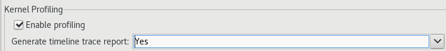

1. Click Arguments tab, uncheck the *Automatically add binary container(s) to arguments* option, and then enter `../binary_container_1.awsxclbin`

	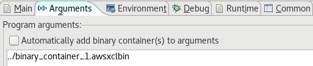

1. Execute the application by clicking **Apply** and then **Run**. The FPGA bitstream will be downloaded and the host application will be executed showing output similar to:

	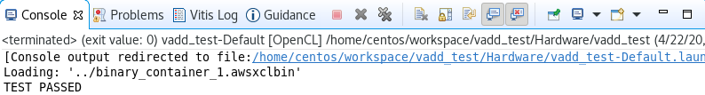

### Analyze hardware application timeline and profile summary

1. In the *Assistant* view, double click `Hardware > vadd-Default > Run Summary (xclbin)` to open Vitis Analyzer

    Vitis Analyzer shows **Run Guidance**, **Profile Summary** and **Application Timeline** panels on the left-hand side. Click **Application Timeline**. Zoom in between 185,800,000 and 186,800,000 microsecond area (note for your output the range may differ depending on what else was executed on the instance) and observe the activities in various parts of the system. Note that the kernel processes data in one shot

	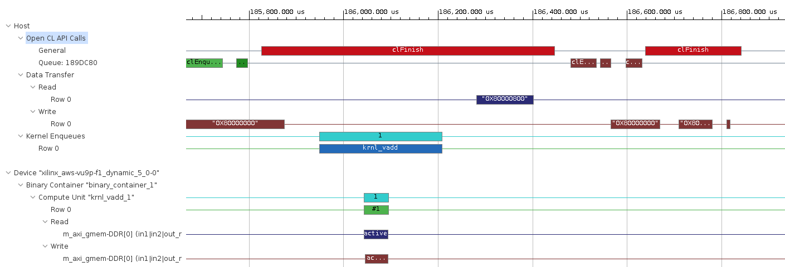

1. Click on the *Profile Summary* entry in the left panel, and observe multi-tab (four tabs) output

 	- Top Operations

	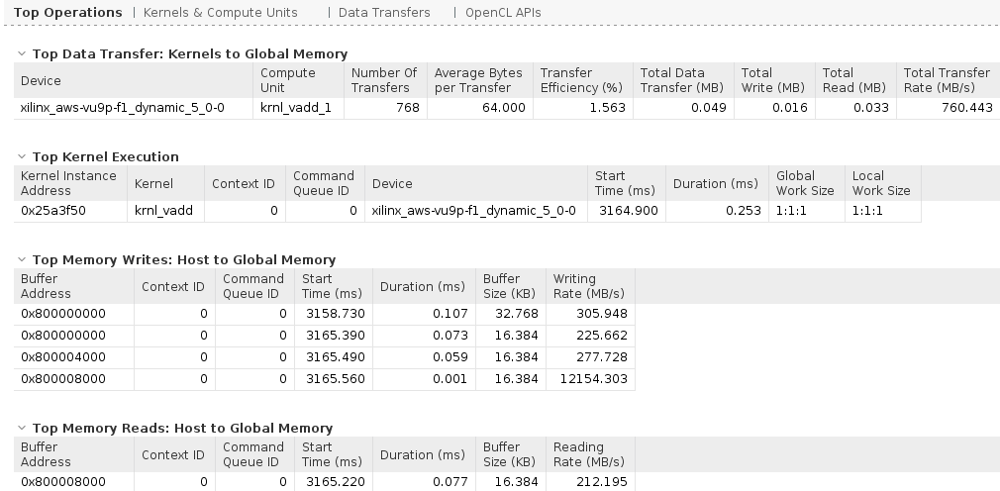

 	- Kernels & Compute Units

	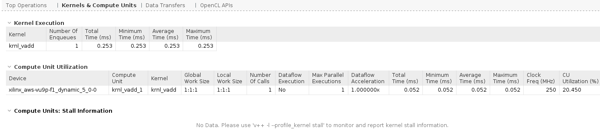

 	- Data Transfers

	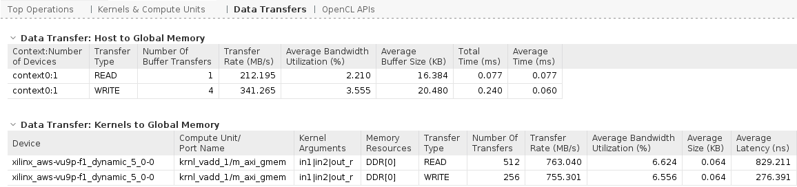

 	- OpenCL APIs

	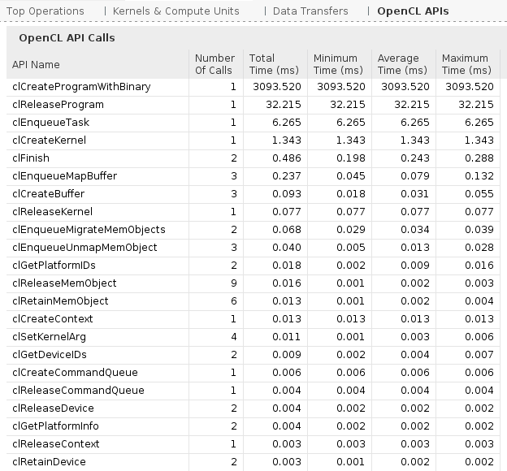

1. When finished, close the analyzer by clicking `File > Exit` and clicking **OK**

1. Review `xrt.ini` file in `Hardware` folder within *Explorer* view

    Earlier, when you set kernel profiling and trace settings, `xrt.ini` file gets updated. During the execution, this updated file is used to generate the profile and application timeline data which are seen using Vitis Analyzer.

	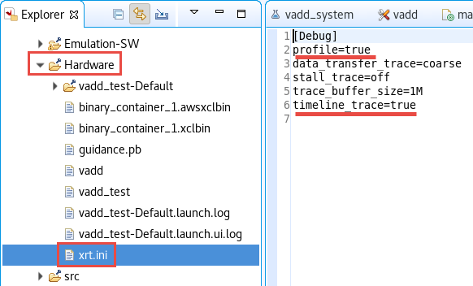


## Conclusion

In this lab, you used Vitis IDE to create a project using one of the application templates. You then ran the design using the software and hardware emulation flows, and reviewed the reports. Since the system build and AFI creation takes relatively long time, you used the provided solution to download the application and kernel on the F1 instance and validated the functionality in hardware. You also analyzed profile and application timeline reports generated during running the application in actual hardware.

---------------------------------------

Start the next lab: [Improving Performance Lab](./Improving_Performance_lab.md)

---------------------------------------

### Appendix: Build Full Hardware

Note that building the project can take around two hours. Skip this step in a tutorial environment.

1. After having setting up all the options described [above](#build-system-hardware-with-profiling-and-timing-analysis-options) you can build the system

1. Click on the () button or select **Project > Build Project**

  This will build the project under the **Hardware** directory. The built project will include **vadd** (executable) file along with **binary\_container\_1.xclbin** file

#### Test on AWS (create AFI)

Before the design can be run on AWS an AFI (Amazon FPGA Image) is required

Once the full system is built, you can create an AFI by following the steps listed in [create an AFI](Creating_AFI.md)
