<table style="width:100%">
  <tr>
    <th width="100%" colspan=8><h2>XUP Vitis Labs (2019.2)</h2></th>
  </tr>
  <tr>
    <td align="center"><a href="setup_vitis.md">1. Setup Vitis</a></td>
    <td align="center"><a href="GUI_Flow_lab.md">2. Introduction to Vitis</a></td>
    <td align="center">3. Improving Performance</a></td>
    <td align="center"><a href="Optimization_lab.md">4. Optimization</a></td>
    <td align="center"><a href="rtl_kernel_wizard_lab.md">5. RTL Kernel Wizard</a></td>
    <td align="center"><a href="debug_lab.md">6. Debugging</a></td>
    <td align="center"><a href="Vision_lab.md">7. Vision Application</a></td>
    <td align="center"><a href="PYNQ_lab.md">8. PYNQ Lab</a></td>
  </tr>
</table>

# Improving Performance

## Introduction

In [GUI Flow lab](GUI_Flow_lab.md), you learned how to create a project using GUI mode and went through entire design flow. At the end of the lab, you saw the limited transfer bandwidth due to 32-bit data operations. This bandwidth can be improved, and in turn system performance can be improved, by transferring wider data, and performing multiple operations in parallel.  This is one of the common optimization methods to improve the kernel's bandwidth.

## Objectives

After completing this lab, you will learn to:

- Create a project using Empty Application template in the Vitis GUI flow
- Import provided source files
- Run Hardware Emulation to see increased bandwidth
- Build the system and test it in hardware
- Perform profile and application timeline analysis in hardware emulation

## Steps

### Create a Vitis Project

1. Source Vitis environment and set environment variables

    If you have opened a new terminal window then execute following two shell scripts and set LIBRARY_PATH

    ```sh
    source ~/aws-fpga/vitis_setup.sh
    source ~/aws-fpga/vitis_runtime_setup.sh
    export LIBRARY_PATH=/usr/lib/x86_64-linux-gnu
    ```

1. Launch Vitis GUI

    Invoke GUI by executing the following command:

    `vitis &`

    Continue with the workspace you have used in previous lab  

1. Create a new acceleration project giving `wide_vadd` as the project name, and click **Next>**

    You should see `xilinx_aws-vu9p-f1_shell-v04261818_201920_1` as one of the platforms if you are continuing with previous lab, otherwise add it from `~/aws-fpga/Vitis/aws_platform`

1. Select `Empty Application` as the template and click **Finish**

    The project is generated

1. Import provided source files from `~/sources/improving_performance_lab/wide_vadd` sub-directories

    Select `src` directory in Explorer view, right click and select `Import Sources...`

  - Import `improving_performance_lab/wide_vadd/hw_src/wide_vadd_krnl.cpp` for hardware accelerator
  - Import all `*.cpp` and `*.hpp` files in `improving_performance_lab/wide_vadd/sw_src/`for host code application

	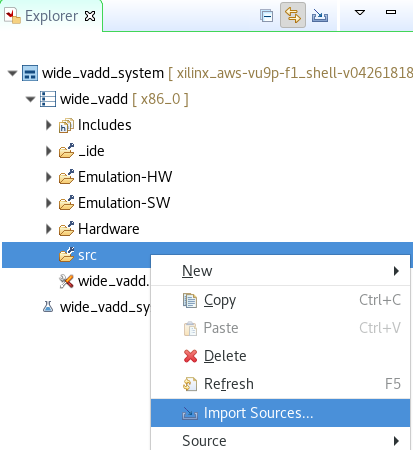

1. Within *Project Editor* view click on  in the *Hardware Functions* window and add `wide_vadd` function as a *Hardware Function* (kernel)

1. Change the binary container name to `wide_vadd_example` by clicking on it once and typing over. This is necessary as the name is hard-coded in `wide_vadd.cpp` on line 69

	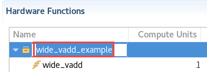

### Analyze the kernel code

The DDR controller natively has a 512-bit wide interface internally. If we parallelize the dataflow in the
accelerator, we will be able to process 16 array elements per clock tick instead of one. So, we should
be able to get an instant 16x computation speed-up by just vectorizing the input

1. Double-click `wide_vadd.cpp` to view its content

    Look at lines 62-67 and note wider (512 bits) kernel interface

	`uint512_dt` is used in stead of `unsigned int` here for input, output and internal variables for data storage.

    ```C
    void wide_vadd(
      const uint512_dt *in1, // Read-Only Vector 1
      const uint512_dt *in2, // Read-Only Vector 2
      uint512_dt *out,       // Output Result
      int size               // Size in integer
    )
    ```

1. Scroll down further and look at lines 78-80 where local memories are defined of the same data type and width (512 bits)

    ```C
    uint512_dt v1_local[BUFFER_SIZE]; // Local memory to store vector1
    uint512_dt v2_local[BUFFER_SIZE];
    uint512_dt result_local[BUFFER_SIZE]; // Local Memory to store result
    ```

### Setup Hardware Emulation

1. Set *Active build configuration:* to **Emulation-HW**

1. Set `HW_EMU` in the host code to use smaller data size (1,024 times smaller) as input to save emulation time (`wide_vadd.cpp` line 41)

  - Right click `wide_vadd` application in Explorer view, select `C/C++ Build Settings`
  - In the left-hand side view select `C/C++ Build > Settings`.
  - In `GCC Host Compiler (x86_64) > Preprocessor`, add `HW_EMU` in `defined symbols` window, and enter **OK**
  - Click **Apply and Close**
  - Click **Yes** to rebuild

	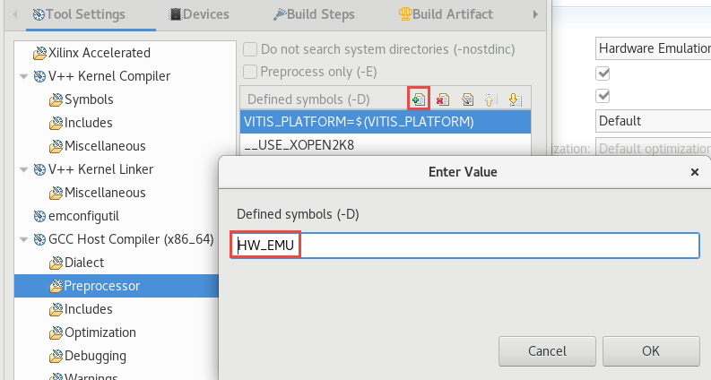

1. Set dedicated location of kernel and memory interface
  - Right click `wide_vadd > Emulation-HW` in *Assistant* view, select `Settings`
  - Navigate to *wide_vadd* kernel, adjust memory and SLR settings according to the screenshot below
  - Click Apply and Close

	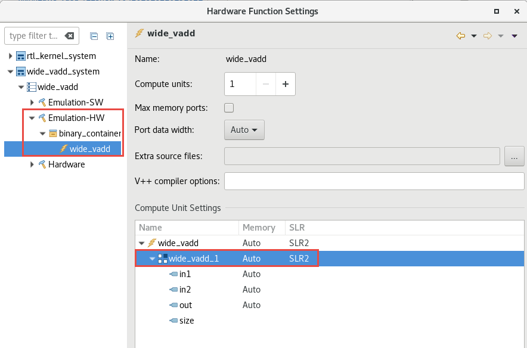

### Build and run in hardware emulation mode

1. Build in Emulation-HW mode

    This will take about 10 minutes

1. After build completes, open *Run Configurations* window

1. Set `Working Directory` at Arguments tab (of Run Configurations) to `${workspace_loc:wide_vadd}/Emulation-HW/` by unchecking *Use default* check-box, and backspacing the directory path. This is because the xclbin location is hard coded in host source code  

	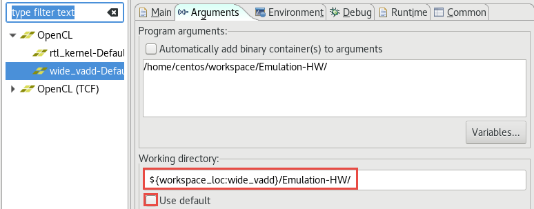

1. Click **Apply** and then **Run**  

    Notice the kernel wait time is about 12 seconds.

	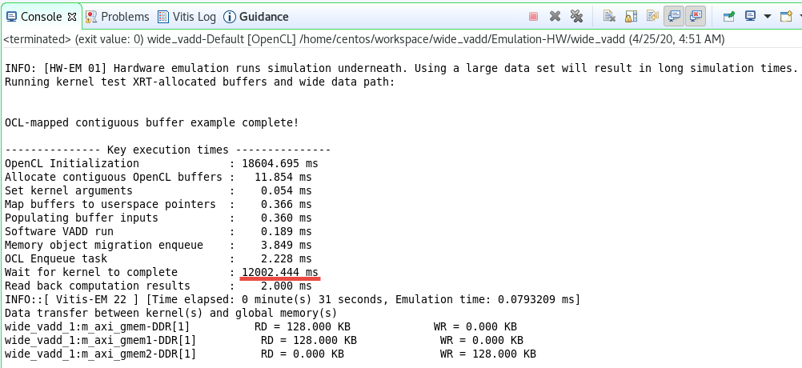

1. Check generated kernel interface

 - Open Link Summary with Vitis Analyzer by expanding `Emulation-HW > wide_vadd_example` and double-clicking `Link Summary`
 - Select **System Diagram**. Notice that all ports (in1, in2, and out) are using one bank
 - Click **Kernels** tab
 - Check the `Port Data Width` parameter. All input and output ports are 512 bits wide whereas size (scalar) port is 32 bits wide

	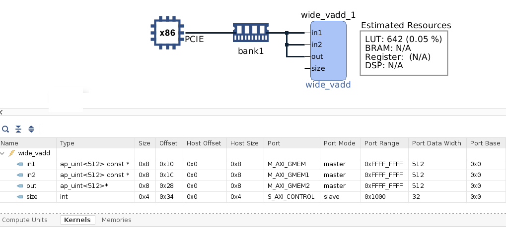

  - Select **Platform Diagram** in the left panel

    Observe that there are four DDR4 memory banks and two PLRAM banks. In this design, `bank1`, which uses SLR2, is being used for all operands.  Also notice that `bank0` and `bank2` are connected to SLR1  

	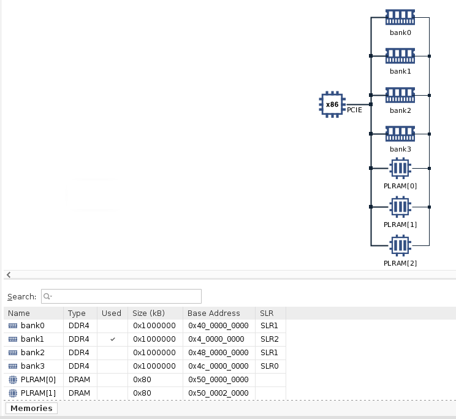

1. Close the Vitis Analyzer.

1. Run Vitis Analyzer on timing trace

    ```sh
    cd /home/centos/workspace/wide_vadd/Emulation-HW
    vitis_analyzer timeline_trace.csv
    ```

1. Zoom into area where data transfer on various ports of the kernel is taking place and observe the sequential data transfer between two input operands and a result since only one memory controller is being used

	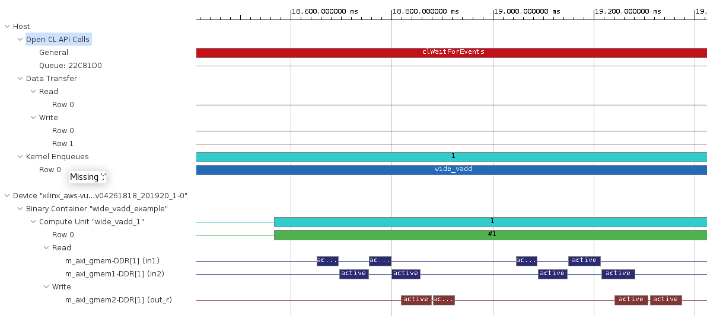


### Use multiple memory banks

There are four DDR4 memory banks available on the accelerator card. In the previous section, we used only one bank. As we have three operands (two read and one write) it may be possible to improve performance if more memory banks are used simultaneously, providing maximize the bandwidth available to each of the interfaces. So it is possible to use the topology shown in following Figure.

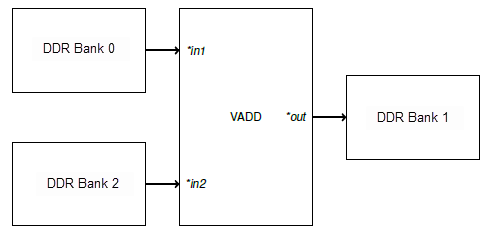

This will provide the ability to perform high-bandwidth transactions simultaneously with different
external memory banks. Remember, long bursts are generally better for performance than many small reads
and writes, but you cannot fundamentally perform two operations on the memory at the same time.

To connect a kernel to multiple memory banks, you need to

 1. Assign the kernel's interface to a memory controller
 2. Assign the kernel to an SLR region

Please note that since the DDR controllers are constrained to different SLR (Super Logic Region), the routing between two SLR may have some challenges in timing closure when the design is compiled for bitstream. This technique is valuable in the cases where one SLR has two DDR controllers.

1. Assign memory banks as shown in figure below
  - Right click `wide_vadd > Emulation-HW` in *Assistant* view, select `Settings`
  - Navigate to `wide_vadd` kernel, and adjust memory and SLR settings
  - Click Apply and Close

	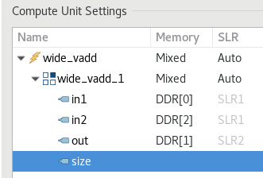

1. Build Emulation-HW

    This will take about 10 minutes. After build completes, open Run Configurations window

1. Click **Run**  

    Notice that the kernel wait time has reduced from about 12 seconds (single memory bank) to 9 seconds (two memory banks) indicating performance improvement

	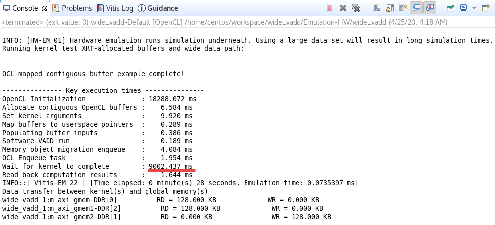

1. Check generated kernel interface

 - Open Link Summary with Vitis Analyzer by expanding `Emulation-HW > wide_vadd_example` and double-clicking `Link Summary`
 - Select System Diagram
 - Click *Kernels* tab

    Notice all ports (in1, in2, and out) are using different memory banks

	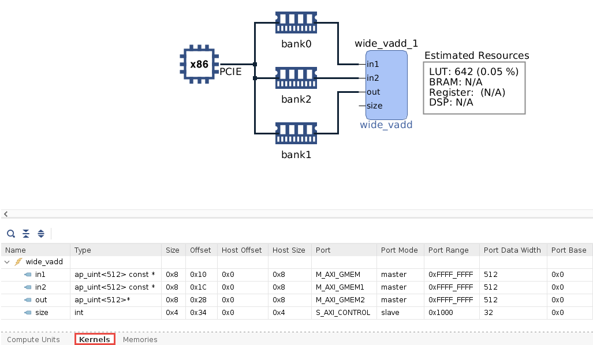

1. Run Vitis Analyzer on timing trace

    ```sh
    cd /home/centos/workspace/wide_vadd/Emulation-HW
    vitis_analyzer timeline_trace.csv
    ```
1. Zoom into area where data transfer on various ports of the kernel is taking place and observe that data fetching is taking place in parallel and result is written overlapping the fetching data, increasing the bandwidth

	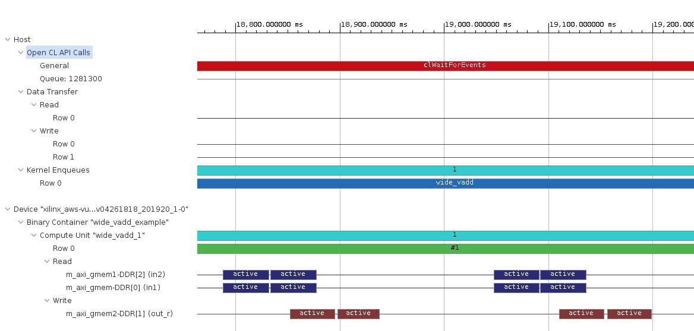

1. Close Vitis Analyzer

## Conclusion

From a simple vadd application, we explored several steps to increase system performance:
- Expand kernel interface width
- Assign dedicated memory controller
- Use Vitis Analyzer to view the result

---------------------------------------

Start the next lab: [Optimization Lab](./Optimization_lab.md)
