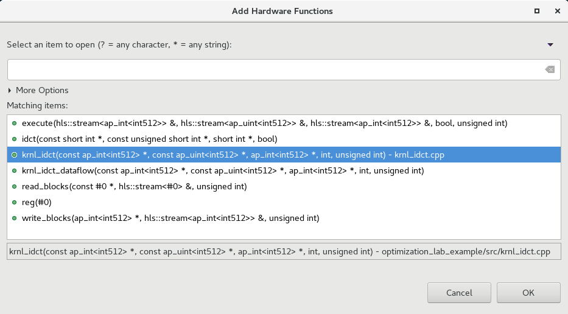
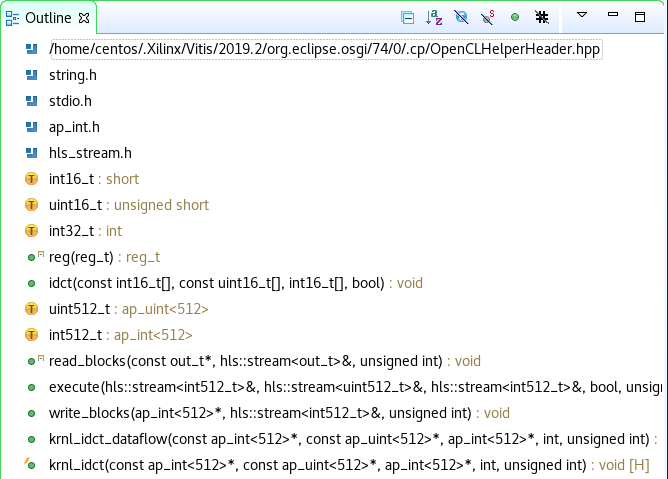
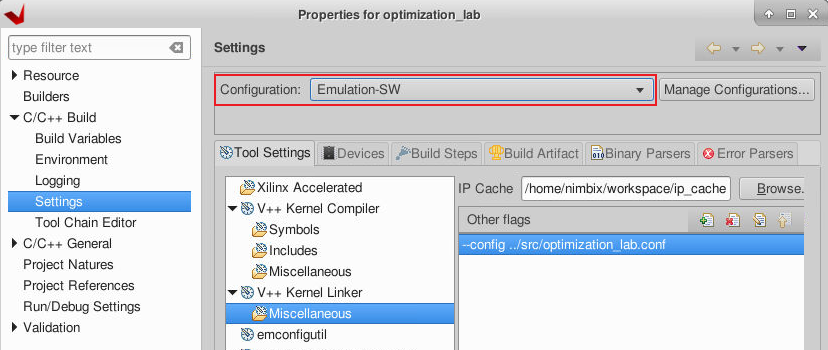
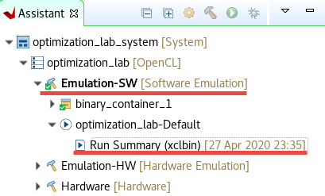
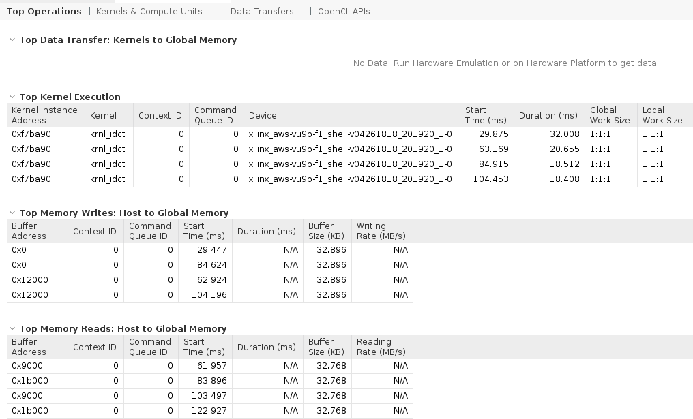
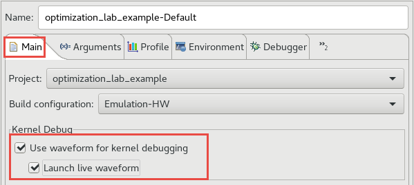
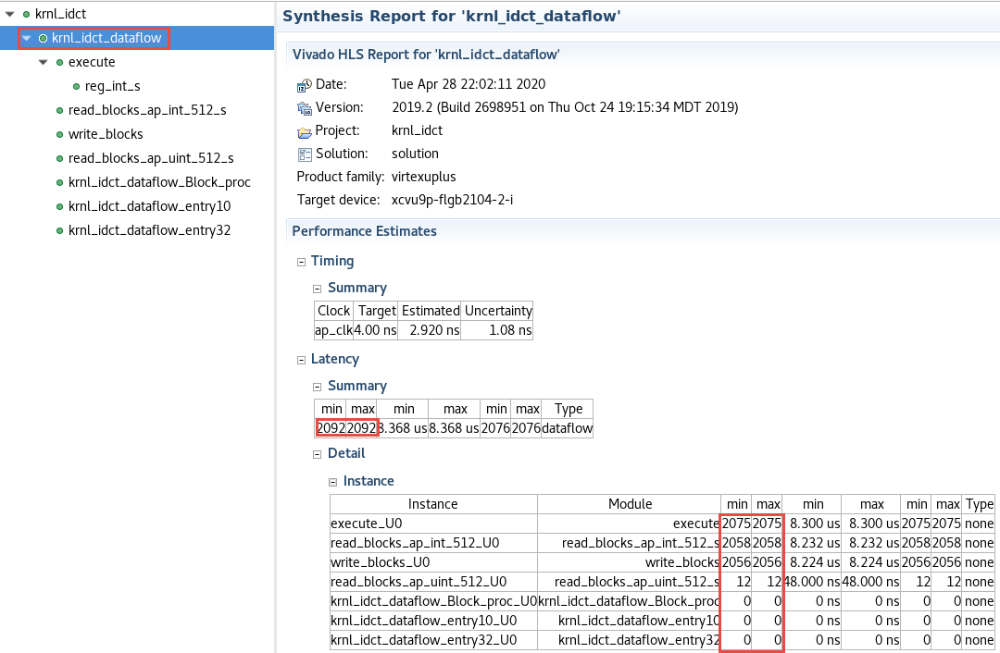
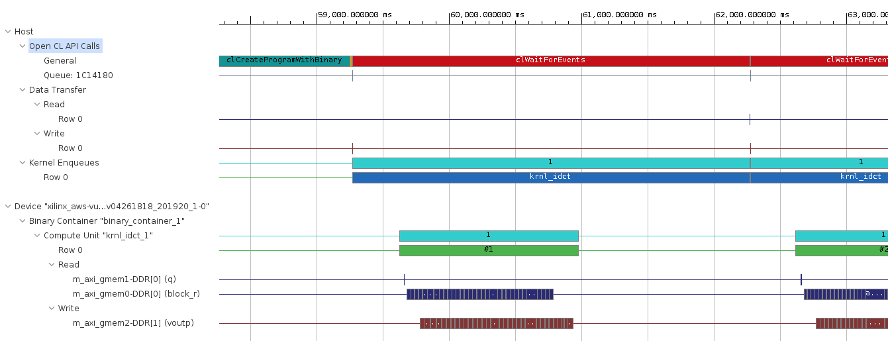
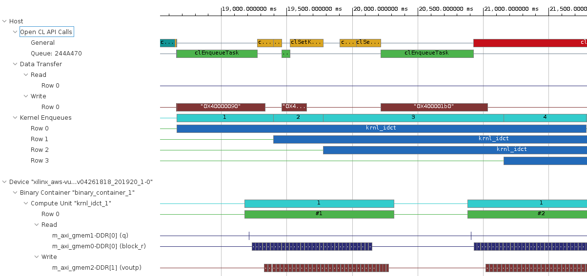

<table style="width:100%">
  <tr>
    <th width="100%" colspan=8><h2>XUP Vitis Labs (2019.2)</h2></th>
  </tr>
  <tr>
    <td align="center"><a href="setup_vitis.md">1. Setup Vitis</a></td>
    <td align="center"><a href="GUI_Flow_lab.md">2. Introduction to Vitis</a></td>
    <td align="center"><a href="Improving_Performance_lab.md">3. Improving Performance</a></td>
    <td align="center">4. Optimization</a></td>
    <td align="center"><a href="rtl_kernel_wizard_lab.md">5. RTL Kernel Wizard</a></td>
    <td align="center"><a href="debug_lab.md">6. Debugging</a></td>
    <td align="center"><a href="Vision_lab.md">7. Vision Application</a></td>
    <td align="center"><a href="PYNQ_lab.md">8. PYNQ Lab</a></td>
  </tr>
</table>


# Optimization Lab

## Introduction

In this lab you will create a Vitis project and analyze the design to optimize the host code and kernel code to improve the performance of the design.

## Objectives

After completing this lab, you will be able to:

- Analyze the design and read project reports
- Optimize the kernel code to improve throughput
- Optimize the host code to improve the data transfer rate
- Verify the functionality of the design in hardware

### Create a Vitis Project

1. Start Vitis and select the default workspace (or continue with the workspace from the previous lab)

1. Create a new application project

     Use `Create Application Project` from Welcome page, or use `File > New > Application Project` to create a new application

1. In the *New Application Project's* page enter **optimization\_lab** in the *Project name:* field and click **Next>**

1. Select your target platform and click **Next>**

    You should see `xilinx_aws-vu9p-f1_shell-v04261818_201920_1` as one of the platforms if you are continung with previous lab, otherwise add it from `~/aws-fpga/Vitis/aws_platform`

1. Select **Empty Application** template and click **Finish**

### Import the source files into the project

1. In the *Explorer* view expand the *optimization_lab* folder if necessary, and right-click on the **src** folder and select **Import Sources...**

1. Browse to the source directory at **~/compute\_acceleration/sources/optimization\_lab** and click **OK**

1. Select **idct.cpp** and **krnl\_idct.cpp** files and click **Finish**

1. Expand the **src** folder in the *Explorer* view and note the two added files

### Add a function as a hardware kernel

1. Click on the *Add Hardware Function* button icon () in the **Hardware Functions** window to see functions available for implementation in hardware

1. Select *krnl\_idct* function and click **OK**

    

1. Notice a **binary\_container\_1** folder is created automatically under which the *krnl\_idct* function is added

### Analyze the source files

1. From the *Explorer* view open the **src > krnl\_idct.cpp** file

1. The **Outline** panel should be visible. It displays an outline of the code of the source file that is currently in scope. If you can't see it, go to **Window > Show View** then select **General > Outline**

    The outline view can be used to navigate the source file. For example, function names are displayed in the outline view, and clicking on a function will jump to the line of code where the function is defined

    

1. In the *Outline* viewer, click **idct** to look up the function

The `idct()` function is the core algorithm in the kernel. It is a computationally intensive function that can be highly parallelized on the FPGA, providing significant acceleration over a CPU-based implementation

1. Review the code

    - **krnl\_idct** : Top-level function for the hardware kernel. Interface properties for the kernel are specified in this function
    - **krnl\_idct\_dataflow** : Called by the **krnl\_idct** function and encapsulates the main functions of the kernel
    - **read\_blocks** : Reads data from global memory data sent by the host application and streams to the *execute* function
    - **execute** : For each 8x8 block received, calls the **idct** function to perform the actual IDCT computation
    - **write\_blocks** : Receives results from the **execute** function and writes them back to global memory for the host application  

1. Open the **idct.cpp** file.  Again, use the *Outline* viewer to quickly look up and inspect the important functions of the host application:  
    - **main** : Initializes the test vectors, sets-up OpenCL resources, runs the reference model, runs the hardware kernel, releases the OpenCL resources, and compares the results of the reference IDCT model with the hardware implementation
    - **runFPGA** : Takes in a vector of inputs and for each 8x8 block calls the hardware accelerated IDCT using the **write** , **run** , **read** , and **finish** helper functions. These function use OpenCL API calls to communicate with the FPGA
    - **runCPU** : Takes in a vector of inputs and, for each 8x8 block, calls **idctSoft** , a reference implementation of the IDCT
    - **idctSoft** : Software implementation of the IDCT algorithm, used to check the results from the FPGA
    - **oclDct** : This class is used to encapsulate the OpenCL runtime calls to interact with the kernel in the FPGA
    - **aligned\_allocator** , **smalloc** , **load\_file\_to\_memory** : These are small helper functions used during test vector generation and OpenCL setup  

1. Look at the code around line number 500 of the **idct.cpp** file by pressing Ctrl+l (small L) and entering 496.
  This section of code is where the OpenCL environment is setup in the host application. It is typical of most Vitis application and will look very familiar to developers with prior OpenCL experience. This body of code can often be reused as-is from project to project
To setup the OpenCL environment, the following API calls are made:
- **clGetPlatformIDs** : This function queries the system to identify any available OpenCL platforms. It is called twice as it first extracts the number of platforms before extracting the actual supported platforms
- **clGetPlatformInfo** : Gets specific information about the OpenCL platform, such as vendor name and platform name
- **clGetDeviceIDs** : Obtains list of devices available on a platform
- **clCreateContext** : Creates an OpenCL context, which manages the runtime objects
- **clGetDeviceInfo** : Gets information about an OpenCL device like the device name
- **clCreateProgramWithBinary** : Creates a program object for a context, and loads specified binary data into the program object. The actual program is obtained before this call through `load_file_to_memory()` function
- **clCreateKernel** : Creates a kernel object
- **clCreateCommandQueue** : Creates a command-queue on a specific device  


Note: all objects accessed through a **clCreate...** function call should be released before terminating the program by calling a corresponding **clRelease...**  This avoids memory leakage and clears the locks on the device

### Configure the System Port options

#### Configure the System Port in the Vitis GUI

In the *idct.cpp* file, locate lines 286-297. Note that two memory buffers, *mInBuffer* and *mOutBuffer* are being used. The memory buffers will be located in external DRAM. The kernel will have one or more ports connected to the memory bank(s). By default, the compiler will connect all ports to BANK0 or DDR[0]. Memory interfaces can be configured from the Vitis GUI, or via a "System Port" switch (--sp) that is passed to the XOCC Kernel Linker.

1. In the *Assistant* view, right click on Emulation-SW and click **Settings**
1. In the *Hardware Function Settings* expand *optimization\_lab > Emulation-SW > binary\_container\_1* and select **krnl_idct**
1. Under *Compute Unit Settings* expand *krnl\_idct* and *krnl\_idct\_1*
1. From the dropdown block under *Memory* select the following:
   * **block**: DDR[0]
   * **q**: DDR[0]
   * **voutp**: DDR[1]

	

1. Click **Apply and Close**

#### Configure the System Port command line switch

In Vitis, you can set memory interfaces by passing a config file with the `--config` compiler switch to the Vitis kernel linker. To this end, the file must contain the `[connectivity]` indicator

```sh
[connectivity]
sp=<kernel_instance_name>.<interface_name>:<bank_name>
```

* **kernel_instance_name** is the instance name of the kernel
* **interface_name** is the name of the memory interface
* **bank_name** is the name of the bank where the memory is going to be mapped

The interface names can be found in the *Explorer* view **Emulation-SW (or Emulation-HW) > binary\_container\_1.xclbin.info** log file.

1. In this case the configuration file  would be

    ```sh
    [connectivity]
    sp=krnl_idct_1.block:DDR[0]
    sp=krnl_idct_1.q:DDR[0]
    sp=krnl_idct_1.voutp:DDR[1]
    ```


1. In the *Explore* view, right-click the project **optimization_lab** and select the **C/C++ Settings**

1. Select **C/C++ Build** > **Settings** in the left pane
1. Select the **Miscellaneous** under **Vitis Kernel Linker**. Make sure you add this switch for every solution.
1. You can also pass the configuration file using the **V++ compiler options:** of the Hardware function settings windows, but again this must be done for every solution

	

### Build and run software emulation (Emulation-SW)

1. Make sure the **optimization_lab.prj** under *optimization\_lab* in the *Explorer* view is selected
1. Select **Emulation-SW** as the *Active Build Configuration*
1. Build the project by clicking () button  
1. In the Explorer pane, right-click the project **optimization\_lab** and select **Run As > Run Configurations…**
1. Select the **Arguments** tab
1. Click on the **Automatically add binary container(s) to arguments** check box.

    This will add **../binary\_container\_1.xclbin** automatically
1. Click **Apply** and then click **Run**  

    The application will be run and the output will be displayed in the Console tab

	


### Review the software emulation reports

1. In the *Assistant* view, expand **optimization\_lab** > **Emulation-SW** > **optimization\_lab-Default** and double-click on **Run Summary (xclbin)**

	

    The *Vitis Analyzer* application will open, showing two panels on left: Profile Summary and Application Timeline

1. Click on the **Profile Summary** and review it  

	

1. Click on each of tabs and review them

1. Click the **Application Timeline** report and review it

    

	The **Application Timeline** collects and displays host and device events on a common timeline to help you understand and visualize the overall health and performance of your systems. These events include OpenCL API calls from the host code: when they happen and how long each of them takes.

1. Close the Vitis Analyzer by clicking **File > Exit** and then clicking **OK**

### Perform HW Emulation      

1. Click on the drop-down button of _Active build configuration_ and select **Emulation-HW**

1. [Assign the System Ports as you did in the Emulation-SW mode](#configure-the-system-port-in-the-vitis-gui)

   * Right-click on *Assistant view > Emulation-HW* and click **Settings**

   * Expand *optimization\_lab > Emulation-HW > binary\_container\_1* and select **krnl\_idct**

   * Under *Compute Unit Settings* expand *krnl\_idct* and krnl\_idct\_1

   * Select the following:

      - **block**: DDR[0]
      - **q**: DDR[0]
      - **voutp**: DDR[1]

1. Click **Apply and Close**

1. Build the project ()

    Wait for the build to complete which will generate binary_container_1.xclbin file in the Emulation-HW directory

    >There is a bug in waveform viewer not showing in Vivado simulation. To workaround that a tcl script is provided in ~/compute_acceleration/sources/optimization_lab folder

1. In a terminal window, execute the following commands to create another xclbin file which will be used to view the waveform

    ```sh
    cd ~/workspace/optimization_lab/Emulation-HW
    ~/compute_acceleration/sources/optimization_lab/waveform_patch.tcl binary_container_1.xclbin binary_container_2.xclbin
    ```

    This will create binary_container_2.xclbin which will be used in run_configuration settings

1. Select **Run > Run Configurations…** to open the configurations window

1. In the *Main* tab, click to select **Use waveform for kernel debugging** and **Launch live waveform**

    

1. Click on the **Arguments** tab, uncheck **Automatically add binary container(s) to arguments**, and enter  *../binary\_container\_2.xclbin* in the box as a file to be used  

1. Click **Apply** and then **Run** to run the application  

	The Console tab shows that the test was completed successfully along with the data transfer rate  

    

	Notice that Vivado was started and the simulation waveform window is updated.

1. Click on the Zoom Fit () button and scroll down the waveform window to see activities taking place in the kernel  

	Notice that the execution is sequential

	

	Close Vivado when you are ready by selecting **File > Exit** and clicking **OK**. We will not examine the transactions in detail.

### Understand the HLS Report, profile summary, and Application Timeline

1. In the *Assistant* view, expand *optimization\_lab > Emulation-HW > optimization\_lab-Default* and double-click on **Run Summary (xclbin)**

1. The *Vitis Analyzer* window will update and now it includes *xclbin (Hardware Emulation)*

1. Click the *xclbin (Hardware Emulation) > Profile Summary* report and review it

	

1. Click on the **Kernels &amp; Compute Units** tab of the Profile Summary report

1. Review the Kernel **Total Time (ms)**  

    This number will serve as a baseline (reference point) to compare against after optimization. This baseline may be different depending on the target platform

	

1. In the *Assistant* view, expand *optimization\_lab > Emulation-HW > binary\_container\_1 > krnl\_idct* and double-click on **Compile Summary (krnl\_idct)**

1. The *Vitis Analyzer* window will update and now it includes *krnl\_idct (Hardware Emulation)* within *BUILD*

1. Click on **HLS Synthesis** and review it

    

1. In the **Performance Estimates** section, expand the **Latency (clock cycles)** > **Summary** and note the following numbers:  

    - Latency (min/max): ~6,000

    The numbers may vary slightly depending on the target hardware you selected.
    The numbers will serve as a baseline for comparison against optimized versions of the kernel

1. In the HLS report, expand **Latency (clock cycles)** > **Detail** > **Instance**

    - Note that the 3 sub-functions read, execute and write have roughly the same latency and that their sum total is equivalent to the total Interval reported in the Summary table
    - This indicates that the three sub-functions are executing sequentially, hinting to an optimization opportunity

1. Close all the reports by selecting **File > Exit**

### Analyze the kernel code and apply the DATAFLOW directive

1. Open the **src > krnl\_idct.cpp** file

1. Using the **Outline** viewer, navigate to the **krnl\_idct\_dataflow** function  

    Observe that the three functions are communicating using **hls::streams** objects. These objects model a FIFO-based communication scheme. This is the recommended coding style which should be used whenever possible to exhibit streaming behavior and allow **DATAFLOW** optimization

1. Enable the DATAFLOW optimization by uncommenting the **#pragma HLS DATAFLOW** present in the krnl\_idct\_dataflow function (line 319)

    The DATAFLOW optimization allows each of the subsequent functions to execute as independent processes. This results in overlapping and pipelined execution of the read, execute and write functions instead of sequential execution. The FIFO channels between the different processes do not need to buffer the complete dataset anymore but can directly stream the data to the next block.

1. Save the file

### Build the project in Hardware Emulation configuration and analyze the HLS report

1. Make sure the active configuration is **Emulation-HW**

1. Click on the Build button () to build the project

1. In the *Assistant* view, expand *optimization\_lab > Emulation-HW > binary\_container\_1 > krnl\_idct* and double-click on **Compile Summary (krnl\_idct)**

1. The *Vitis Analyzer* window will update *krnl\_idct (Hardware Emulation)* with in *BUILD*

1. Click on **HLS Synthesis** and review it

	

1. In the **Performance Estimates** section, expand the *Latency (clock cycles) > Summary* and note the following numbers:
    - Latency (min/max): ~2,000

###  Run the Hardware Emulation

1. In a terminal window, execute the following commands to create another xclbin file which will be used to view the waveform

    ```sh
    cd ~/workspace/optimization_lab/Emulation-HW
    ~/compute_acceleration/sources/optimization_lab/waveform_patch.tcl binary_container_1.xclbin binary_container_3.xclbin
    ```

    This will create binary_container_3.xclbin which will be used in run_configuration settings

1. Change the run configuration to use *binary\_container\_3.xclbin* and then run the hardware emulation. Wait for the run to finish with RUN COMPLETE message

    Notice the effect of the dataflow optimization in the Vivado simulation waveform view. Execution of reading, writing, pipelining and kernel is not sequential.

	

1. In the *Assistant* view, expand *optimization\_lab > Emulation-HW > optimization\_lab-Default*  and double-click the **Run Summary (xclbin)**

    The *Vitis Analyzer* will update. Click on **xclbin (Hardware Emulation) & Profile Summary** within **RUN**

1. Select the **Kernels & Compute Units** tab.  
    Compare the **Kernel Total Time (ms)** with the results from the un-optimized run (numbers may vary slightly to the results displayed below)

	

### Analyze the host code

1. Open the **src > idct.cpp** file

1. Using the *Outline* viewer, navigate to the **runFPGA** function  

    For each block of 8x8 values, the **runFPGA** function writes data to the FPGA, runs the kernel, and reads results back. Communication with the FPGA is handled by the OpenCL API calls made within the `cu.write()`, `cu.run()` and `cu.read()` function calls

    - `clEnqueueMigrateMemObjects()` schedules the transfer of data to or from the FPGA
    - `clEnqueueTask()` schedules the executing of the kernel

    These OpenCL functions use events to signal their completion and synchronize execution  

1. Open the **Application Timeline** of the *Emulation-HW* run in **Vitis Analyzer**.

    The green segments at the bottom indicate when the IDCT kernel is running

    

    Notice that there are gaps between each of the green segments indicating that the operations are not overlapping

1. Zoom in by performing a left mouse drag across one of these gaps to get a more detailed view  

    - The two green segments correspond to two consecutive invocations of the IDCT kernel
    - The gap between the two segments is indicative of the kernel idle time between these two invocations
    - The **Data Transfer** section of the timeline shows that **Read** and **Write** operations are happening when the kernel is idle
    - The Read operation is to retrieve the results from the execution which just finished and the Write operation is to send inputs for the next execution
    - This represents a sequential execution flow of each iteration

1. Close the **Application Timeline**  

1. In the **idct.cpp** file, go to the `oclDct::write()` function (line ~260)

     Notice on line ~274, the function synchronizes on the **outEvVec** event through a call to `clWaitForEvents()`

    ```C
    clWaitForEvents(1, &outEvVec[mCount]);
    ```

    - This event is generated by the completion of the `clEnqueueMigrateMemObjects()` call in the `oclDct::read()` function (line ~346)
    - Effectively the next execution of the `oclDct::write()` function is gated by the completion of the previous `oclDct::read()` function, resulting in the sequential behavior observed in the **Application Timeline**

1. Use the **Outline** viewer to locate the definition of the **NUM\_SCHED** macro in the **idct.cpp** file
    - This macro defines the depth of the event queue
    - The value of 1 explains the observed behavior: new tasks (write, run, read) are only enqueued when the previous has completed effectively synchronizing each loop iteration
    - By increasing the value of the **NUM\_SCHED** macro, we increase the depth of the event queue and enable more blocks to be enqueued for processing, which may result in the write, run and read tasks to overlap and allow the kernel to execute continuously or at least more frequently
    - This technique is called software pipelining

1. Modify line 152 to increase the value of **NUM\_SCHED** to 6 as follows  

    ```C
    #define NUM_SCHED 6
    ```

1. Save the file

### Run Hardware Emulation

1. Build the application by clicking on the () button

1. Change the run configuration by unchecking the **Use waveform for kernel debugging** option, click **Apply**, and then click **Close**

1. Run the application by clicking the Run button ()  
    Since only the idct.cpp file was changed, the incremental makefile rebuilds only the host code before running emulation

    This should be much faster as no recompiling the kernel to hardware is needed

1. In the *Assistant* view, expand *optimization\_lab > Emulation-HW > optimization\_lab-Default* and click on **Run Summary (xclbin)**

1. On *Vitis Analyzer* window click on **xclbin (Hardware Emulation) > Application Timeline** report within **RUN**

    Observe how **software pipelining** enables overlapping of data transfers and kernel execution.
​
	

    Note: system tasks might slow down communication between the application and the hardware simulation, impacting on the performance results. The effect of software pipelining is considerably higher when running on the actual hardware.

###  Run the Application in hardware

As before, building the FPGA hardware takes some time, and a precompiled solution is provided.

1. Set *Active build configuration:* to **Hardware**

1. Change to the solution directory by executing the following command

    ```sh
    cd ~/compute_acceleration/solutions/optimization_lab
    ```

1. Copy the *binary_container_1.xclbin*, *binary_container_1.awsxclbin*, and *optimization_lab* files into `~/workspace/optimization_lab/Hardware` folder. Make sure *optimization_lab* has executable permissions. Use the following commands:

    ```sh
    cp ~/compute_acceleration/solutions/optimization_lab/* ~/workspace/optimization_lab/Hardware/.
    chmod +x ~/workspace/optimization_lab/Hardware/optimization_lab
    ```
  Setup the run configuration so you can run the application and then analyze results from GUI

1. Right-click on Hardware in *Assistant* view, select `Run > Run Configurations...`

    Change Generate timeline trace report option from *Default* to *Yes* using the drop-down button in the Main tab.

1. Click **Arguments** tab, uncheck the *Automatically add binary container(s) to arguments* option, and then enter `../binary_container_1.awsxclbin`

1. Execute the application by clicking on **Apply** and then **Run**. The FPGA bitstream will be downloaded and the host application will be executed showing output similar to:

	

### Analyze hardware application timeline and profile summary

1. In the *Assistant* view, double click `Hardware > optimization_lab-Default > Run Summary (xclbin)` to open Vitis Analyzer

    Vitis Analyzer shows **Run Guidance**, **Profile Summary** and **Application Timeline** panels on the left-hand side. Click **Application Timeline**. Zoom in between 185,800,000 and 186,800,000 microsecond area (note for your output the range may differ depending on what else was executed on the instance) and observe the activities in various parts of the system. Note that the kernel proceses data in one shot

	

1. Click on the *Profile Summary* entry in the left panel, and observe multi-tab (four tabs) output

 	- Top Operations

	

 	- Kernels & Compute Units

	

 	- Data Transfers

	

1. When finished, close the analyzer by clicking `File > Exit` and clicking **OK**


## Conclusion

In this lab, you used Vitis to create a project and add a kernel (hardware) function. You performed software and hardware emulation, analyzed the design and the various reports generated by the tools. You then optimized the kernel code using the DATAFLOW pragma, and host code by increasing the number of read, write, and run tasks to improve throughput and data transfer rates. You then validated the functionality in hardware.

---------------------------------------

Start the next lab: [RTL-Kernel Wizard Lab](rtl_kernel_wizard_lab.md)

---------------------------------------


## Appendix Build Full Hardware

**Set the build configuration to Hardware and build the system (Note that since the building of the project takes over two hours skip this step in the workshop environment).**  

* Click on the drop-down button of *Active build configuration:* and select **Hardware**  
* Set the [Vitis Kernel Linker flag as  before](#configure-the-system-port-in-the-vitis-gui).
* Either select **Project > Build Project** or click on the () button.    
This will build the project under the **Hardware** directory. The built project will include **optimization\_lab** file along with **binary\_container\_1.xclbin** file. This step takes about two hours  

### AWS-F1

Once the full system is built, you should [create an AWS F1 AFI](Creating_AFI.md) to run this example in AWS-F1.
