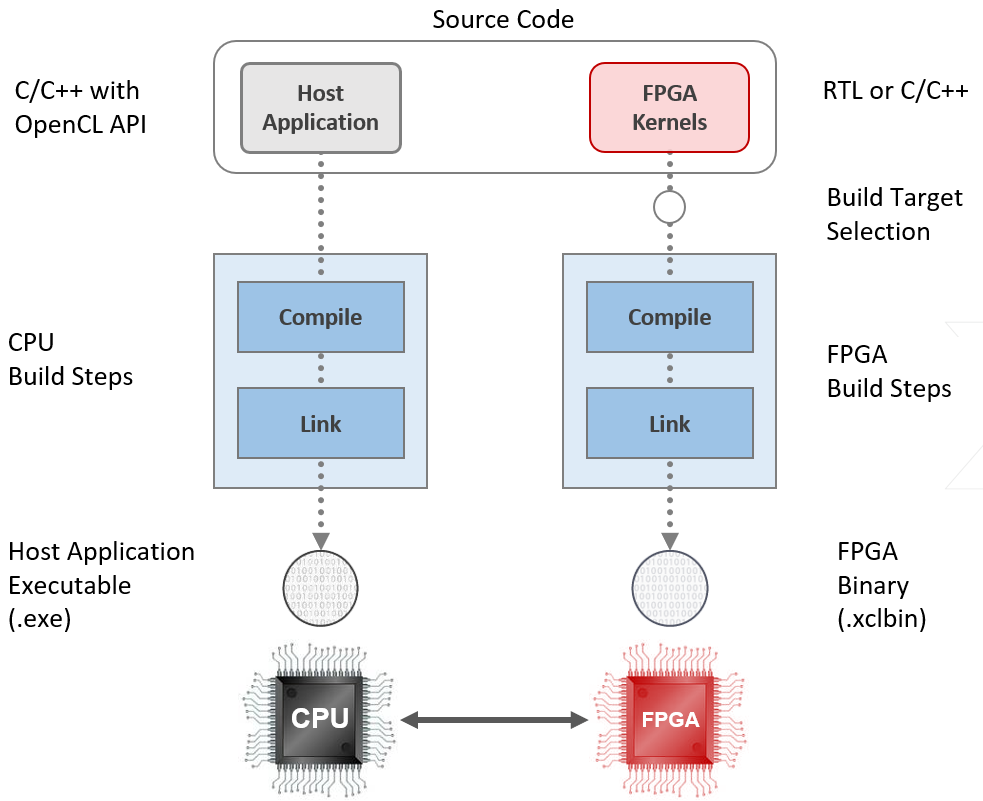

# XUP Vitis Labs (2019.2)

<table style="width:100%">
  <tr>
    <th width="100%" colspan=8><h2>XUP Vitis Labs (2019.2)</h2></th>
  </tr>
  <tr>
    <td align="center"><a href="setup_vitis.md">1. Setup Vitis</a></td>
    <td align="center"><a href="GUI_Flow_lab.md">2. Introduction to Vitis</a></td>
    <td align="center"><a href="Improving_Performance_lab.md">3. Improving Performance</a></td>
    <td align="center"><a href="Optimization_lab.md">4. Optimization</a></td>
    <td align="center"><a href="rtl_kernel_wizard_lab.md">5. RTL Kernel Wizard</a></td>
    <td align="center"><a href="debug_lab.md">6. Debugging</a></td>
    <td align="center"><a href="Vision_lab.md">7. Vision Application</a></td>
    <td align="center"><a href="PYNQ_lab.md">8. PYNQ Lab</a></td>
  </tr>
</table>

### Introduction

Welcome to the XUP Vitis based Compute Acceleration tutorial. These labs will provide hands-on experience using the [Vitis unified software platform](https://www.xilinx.com/products/design-tools/vitis.html) with Xilinx FPGA hardware.

The Vitis tools can be run on your local machine, or in the cloud (e.g. AWS or Nimbix).

The tutorial instructions target the following hardware and software:

* Vitis 2019.2
* AWS EC2 F1 f1.2xlarge (cloud)
* Alveo U200 (local board, or cloud)

You can build designs locally or in the cloud, and test on hardware locally (if you have an Alveo board) or in the cloud (AWS EC2 F1, Nimbix Alveo U200).

You will learn how to develop applications using the Vitis development environment that supports OpenCL/C/C++ and RTL kernels.

#### Overview of the Vitis flow

1. Vitis is the development environment used to create host applications and hardware accelerators. It includes host CPU and FPGA compilers, and profiling and debugging tools
2. The host application can be written in C or C++ and uses the OpenCL API or the XRT (Xilinx Runtime Library) to interact with the accelerated hardware functions running in the FPGA. The accelerated hardware functions (also referred to as kernels) can be written in C, C++, or RTL

#### Tutorial overview

 It is recommended to complete each lab before proceeding to the next

1. [**Setup Vitis**](setup_vitis.md):
This will show you how to setup Vitis on your own machine, or how to use it in the cloud (instructions are provided for AWS and Nimbix clouds)

1. [**Introduction to Vitis**](GUI_Flow_lab.md):
This lab guides you through the steps involved in using a GUI flow to create a Vitis project. After creating a project, you will run CPU (`sw_emu`) and hardware (`hw_emu`) emulation to verify the functionality. You will then use an AWS F1 instance to validate the design on F1 using a pregenerated host application and FPGA binary. The application is developed using vector addition template which gets installed with Vitis installation

1. [**Improving Performance**](Improving_Performance_lab.md):
This lab shows how bandwidth can be improved, and thus system performance, by using wider data path and transferring data in parallel using multiple memory banks

1. [**Optimization**](Optimization_lab.md):
This lab guides you through analyzing various generated reports and then apply techniques, like `DATAFLOW` on host and `PIPELINING` on kernel side to improve throughput and data transfer rate

1. [**RTL-Kernel Wizard**](rtl_kernel_wizard_lab.md):
This lab guides you through the steps involved in using a RTL Kernel wizard to wrap a user RTL-based IP so the generated IP can be used in Vitis project and application development

1. [**Debug**](debug_lab.md):
This lab will show you how to carry out host application debug, and debug of the hardware kernel

1. [**Vision Accelerated Library**](Vision_lab.md):
This lab walks you through the steps to create a Vitis design with two kernel **image resize** and **image resize and blur** leveraging the [Vitis Accelerated Libraries](https://xilinx.github.io/Vitis_Libraries/), and in the process illustrates how Vision lab can be used

1. [**PYNQ lab**](PYNQ_lab.md):
This lab shows how to develop and optimize Python code targeting Vitis designs

---------------------------------------

When you have setup your instance, go to the first lab [Introduction to Vitis](GUI_Flow_lab.md)
