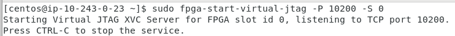

<table style="width:100%">
  <tr>
    <th width="100%" colspan=8><h2>XUP Vitis Labs (2019.2)</h2></th>
  </tr>
  <tr>
    <td align="center"><a href="setup_vitis.md">1. Setup Vitis</a></td>
    <td align="center"><a href="GUI_Flow_lab.md">2. Introduction to Vitis</a></td>
    <td align="center"><a href="Improving_Performance_lab.md">3. Improving Performance</a></td>
    <td align="center"><a href="Optimization_lab.md">4. Optimization</a></td>
    <td align="center"><a href="rtl_kernel_wizard_lab.md">5. RTL Kernel Wizard</a></td>
    <td align="center">6. Debugging</a></td>
    <td align="center"><a href="Vision_lab.md">7. Vision Application</a></td>
    <td align="center"><a href="PYNQ_lab.md">8. PYNQ Lab</a></td>
  </tr>
</table>

# Hardware/Software Debugging

## Introduction

This lab is a continuation of the previous ([RTL-Kernel Wizard Lab](rtl_kernel_wizard_lab.md)) lab. You will use ChipScope to monitor signals at the kernel interface level and perform software debugging using Vitis. Note that this lab is not currently supported on Nimbix as the Xilinx Virtual Cable (XVC is not supported)

## Objectives

After completing this lab, you will be able to:

* Add ChipScope cores to a design created using Vitis
* Use ChipScope to monitor signals at the kernel interface
* Debug a software application in Vitis

## Steps

### Open Vitis and import the project

To save time on compilation, a precompiled project will be provided with the Chipscope debug cores already included in the design.  See Appendix-I to learn how to add ChipScope debug cores

1. Open Vitis and select a new workspace at ~/debug_lab
1. Since this is new workspace, click on **Add Custom Platform** link in the _Welcome_ page, and add the target platform by clicking on "+" sign, browsing to the directory where the target platform is defined
1. From the *Welcome* page, click on the  **Import Project** link
1. In the *Import Projects*, select **Vitis project exported zip file** and click **Next**
1. Click on **Browse** and select **debug_lab** from `~/compute_acceleration/sources/` and click **OK**
     Make sure that the three hierarchical options are checked
1. Click **Next**

#### Set permissions on imported executable

1. In the *Explorer* view, expand the hierarchy and double-click on **rtl_kernel.prj**
1. Set **Hardware** as an _Active build configuration_
1. Expand **rtl_kernel > Hardware**
1. Right click on *rtl_kernel* and select **Properties**

  

1. Tick the box to add **Execute** to the *Owner* permissions, and click **Apply and Close**

  

1. If you don't see an option to set the permissions, open a terminal, browse to the directory containing the rtl_kernel (in Hardware directory), and run the following command to change the permissions to make the file executable:

  ```sh
  chmod +x rtl_kernel
  ```

### Hardware Debugging

#### Review Appendix-I section to understand how to add the ChipScope Debug bridge core and build the project. The debug core has been included in the precompiled sources provided

#### Run the application

1. In *Assistant* view, select **Hardware > Run > Run Configurations...**
1. Expand *OpenCL* and select *debug-Default*
1. For Alveo, in the *Arguments* tab make sure **Automatically add binary container(s) to arguments** is selected. For AWS, make sure the `binary_container_1.awsxclbin` file is listed as an argument
1. Click **Run**

  The host application will start executing, load the bitstream, and wait for user input (press any key to continue)

  

### Set up the Xilinx Virtual Cable (XVC)

The Xilinx Virtual Cable (XVC) is a virtual device that gives you JTAG debug capabilities over PCIe to the target device. XVC will be used to debug the design.

#### For Alveo U200

For an Alveo board, you need to determine the XVC device in your system. XVC is installed as part of the Vitis and XRT installation.

```sh
ls /dev/xvc_pub*
```

This will report something similar to the output below:

```sh
/dev/xvc_pub.u513
```

Each computer may have a different value for *xvc_pub.\** so you will need to check the name for your computer.

* In a terminal window, start a virtual jtag connection

  Run the following command (where *u513* should be the value your obtained from the previous command):

  ```sh
  debug_hw --xvc_pcie /dev/xvc_pub.u513 --hw_server
  ```

  The Virtual JTAG XVC Server will start listening to TCP port **10200** in this case. This is the port you will need to [connect to from Vivado](#connecting-vivado-to-xvc). Note the *hw_server* is listening to TCP port 3121. See example output below

  ```
  launching xvc_pcie...
  xvc_pcie -d /dev/xvc_pub.u513 -s TCP::10200
  launching hw_server...
  hw_server -sTCP::3121

  ****************************
  *** Press Ctrl-C to exit ***
  ****************************
  ```

  Skip the next section and continue with [Connecting Vivado to the XVC](#connect_vivado_to_xvc)

#### For AWS
Open a new terminal window and run the following script which will manage setup of the XVC:

  ```sh
  sudo fpga-start-virtual-jtag -P 10200 -S 0
  ```

  

### Connecting Vivado to XVC

1. Start Vivado from another terminal

  ```sh
  vivado
  ```

1. Click on **Open Hardware Manager** link
1. Click **Open Target > Auto Connect**

  

1. Right click on *localhost (0)* and select **Add Xilinx Virtual Cable (XVC)**

   

1. Enter **localhost** as the *host name*, and **10200** as the port (or the *port number* for your machine obtained previously) and click **OK**

   

1. Right click on the *debug_bridge* and select **Refresh Device**.

  The Vivado Hardware Manager should open showing _Hardware_, _Waveform_, _Settings-hw_, _Trigger-Setup_ windows. The _Hardware_ window also shows the detected ILA cores (*hw_ila_\**), inserted in the design. The Alveo design will have one ILA. The AWS design will have two ILAs, one monitoring the AWS shell interface.

  

1. Select the *debug_bridge* in the Hardware panel
1. In the *Hardware Device Properties* view, click on the browse button beside **Probes file**
1. Browse to the project's **~/debug_lab/rtl_kernel/Hardware** folder, select the **.ltx** file and click **OK**  
1. Select the *hw_ila_1* tab, and notice four (Slot_0 to Slot_3) probes are filled in the Waveform window
1. Click on the **Run Trigger immediate** button and observe the waveform window is fills with data showing that the four channels were _Inactive_ for the duration of the signal capture.

  

1. Expand **slot_1 : KVAdd_1_m01_axi : Interface** , then find and expand  **slot_1 : KVAdd_1_m01_axi : W Channel** in the Waveform window.
1. Select the **WVALID** signal and drag it to the Trigger Setup - hw window

   

1. Click on drop-down button of the Value field and select trigger condition value as **1**

   

1. Click on the *Run trigger* button  and observe the _hw_ila_1_ probe is waiting for the trigger condition to occur

   

1. Switch to the Vitis IDE window select the *Console* window and press the **Enter key** to allow the program to continue executing

  Observe that the program completes displaying **INFO: Test completed successfully** in the Console window

1. Switch back to Vivado and notice that because the trigger condition was met, the waveform window has been populated with new captured data.

   

1. Expand **Slot_0, slot_1,** and **slot_2** groups, zoom in to the region around samples *450 to 1000*, and observe the data transfers taking place on each channels. Also note the addresses from where data are read and where the results are written to.

   

1. Zoom in on one of the transactions and hover your mouse at each successive sample and notice the data content changing
1. When you are finished, close Hardware Manager by selecting **File > Close Hardware Manager**
1. Click **OK** and then close Vivado by selecting **File > Exit**
1. Close the jtag probe by switching to its terminal window and pressing *Ctrl-C*

### Perform Software Debugging

1. Switch to the Vitis GUI

1. In the *Assistant* view, right click on Hardware and select **Debug > Debug Configurations...**

1. Make sure that the **Arguments** tab shows **../binary_container_1.awsxclbin**

1. Click **Apply** if needed, and then click **Debug**

1. Click **Yes** when prompted to switch to the _Debug perspective_
The bitstream will be downloaded to the FPGA and the host application will start executing, halting at **main()** entry point

1. In *host_example.cpp* view scroll down to line ~272 and double-click on the left border to set a breakpoint  At this point, three buffers would have been created

  

1. Click on the **Resume** button or press **F8**

1. When prompted click in the console and press *Enter*

  The program will resume executing and stop when it reaches the breakpoint.    
  At this point you can click on the various monitoring tabs (*Variables, Command Queue, Memory Buffers* etc.) and see the contents currently in scope.
  Vitis debug allows command queues and memory buffers to be examined as the program execution progresses

1. Click back to select *Debug.exe > #Thread 1* in the Debug panel

1. Click on the **Step Over** button or press **F6**

  The execution will progress one statement at a time

1. Continue pressing **F6** until you reach line ~332 at which point kernel will finish executing

1. Select the **Memory Buffers** tab
Notice that three buffers are allocated, their IDs, DDR memory address, and sizes

    

1. Select the **Command Queue** tab and notice that there no commands enqueued.

  

  Lines ~340-344 creates commands to read the data and results

  ```C
  err |= clEnqueueReadBuffer( ... );
  ```

1. Press **F6** to execute the first `clEnqueueReadBuffer()` to create a read buffer command for reading operand *d_A*
Notice the Command Queue tab shows one command submitted

    

1. Press **F6** to execute the next `clEnqueueReadBuffer()` for *d_B*

  Notice the Command Queue tab shows two commands submitted

  

1. Set a breakpoint at line ~398 (`clReleaseKernel()`) and press **F8** to resume the execution  

  Notice that the Command Queue tab still shows entries
1. Press **F6** to execute `clReleaseKernel()`

  Notice the Memory Buffers tab is empty as all memories are released
1. Click **F8** to complete the execution
1. Close the Vitis program

## Conclusion

In this lab, you used the ChipScope Debug bridge and cores to perform hardware debugging. You also performed software debugging using the Vitis GUI.

---------------------------------------

Start the next lab: [Vision Lab](./Vision_lab.md)

---------------------------------------

## Appendix-I

### Steps to Add ChipScope Debug core and build the design

1. In the *Assistant* view, expand **System > binary_container_1 > KVadd**
1. Select **KVAdd**, right-click and select **Settings...**
1. In the **Hardware Function Settings** window, click **Refresh**, and then click on the *ChipScope Debug* option for the *KVAdd* kernel

  

1. Click **Apply and close**
1. In the **Project** tab, expand **rtl_kernel > src > vitis_rtl_kernel > KVAdd** and double-click on the **host_example.cpp** to open it in the editor window
1. Around line 243 (after the *clCreateKernel* section) enter the following lines of code and save the file. This will pause the host software execution after creating kernel but before allocating buffer

  ```C
  printf("\nPress ENTER to continue after setting up ILA trigger...");
  getc(stdin);
  ```
  

1. Build the design

### Disable automatic rebuilding of the design

When you export a project, and re-import it, the file modified dates may change and cause Vitis to make the output executable and hardware kernel "out-of-date". This may cause the design to be automatically recompiled when an attempt is made to run the application from the GUI.  

* To disable automatic rebuilding, right click on the project folder, and select **C/C++ Build Settings**

* Select **C/C++ Build** and click on the **Behavior** tab

* Uncheck the following:
   * Build on resource save (Auto Build)
   * Build (Incremental build)
   * Clean

When you export a project, and re-import it, these settings stop the bitstream being automatically rebuilt.


If you need to rebuild the project, you can re-enable these settings. If you only need to update the host application, you can run the following command in a terminal in the project folder to rebuild the executable file only (where *debug.exe* is the name of the executable):

```sh
cd ./workspace/rtl_kernel/Hardware
make rtl_kernel
```

### References

[Vitis Debugging Applications and Kernels](https://www.xilinx.com/html_docs/xilinx2019_2/vitis_doc/Chunk1842168126.html#pei1519495363831)
