<table style="width:100%">
  <tr>
    <th align="center" width="100%" colspan=8><h2>XUP Vitis Labs (2019.2)</h2></th>
  </tr>
  <tr>
    <td align="center"><a href="setup_vitis.md">1. Setup Vitis</a></td>
    <td align="center"><a href="GUI_Flow_lab.md">2. Introduction to Vitis</a></td>
    <td align="center"><a href="Improving_Performance_lab.md">3. Improving Performance</a></td>
    <td align="center"><a href="Optimization_lab.md">4. Optimization</a></td>
    <td align="center"><a href="rtl_kernel_wizard_lab.md">5. RTL Kernel Wizard</a></td>
    <td align="center"><a href="debug_lab.md">6. Debugging</a></td>
    <td align="center"><a href="Vision_lab.md">7. Vision Application</a></td>
    <td align="center"><a href="PYNQ_lab.md">8. PYNQ Lab</a></td>
  </tr>
</table>

# Connecting to AWS

## Introduction

The following instructions are for attendees for whom an AWS F1 instance has been set by Xilinx, and have been provided with log-in details. If you are not intended to use F1 instance provided by Xilinx, go back to the [Setup Vitis](setup_vitis.md) page and follow one of the other options to work through these labs.

This lab will guide you through the steps involved in connecting to a Xilinx provided AWS EC2 F1 instance, and starting and stopping the instance.

## Objectives

After completing this lab, you will be able to:

- Connect to an AWS EC2 F1 instance using the provided credentials
- Start an instance
- Start a RDP (Remote Desktop Protocol) session
- Close the RDP session
- Stop the instance

## Steps
Each registered participant to Xilinx workshop/webinar has been allocated a pre-configured EC2 F1 instance and should have received an email with the following details:  

- Account ID,
- IAM username,
- Link to access a pre-configured EC2 F1 instance

### Login into the AWS and starting an F1 instance

1. Follow the link provided by your instructor, or go to [https://console.aws.amazon.com/ec2](https://console.aws.amazon.com/ec2) to open a login page. Use `xilinx-aws-f1-developer-labs` in *Account ID or alias*. If you had used the link then you should see a login page similar to shown here:

  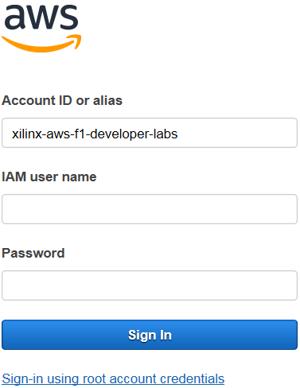

2. Use the log in details provided to you

3. In the top right corner, using the drop-down button, select a region with F1 instances, such as **N. Virginia (US East)** or the region indicated by your instructor

  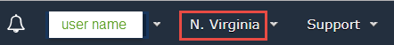

  If you select the wrong region you may not see your instance or you won't see the necessary source and solution files

4. Click on the **EC2** link on the dashboard or if not visible, then click on the _Services_ drop-down button and then click on **EC2**

  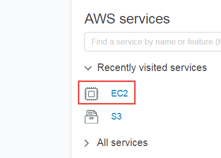
  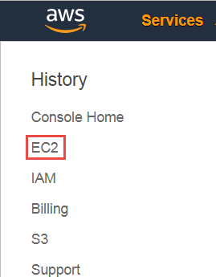

5. Click on the **Instances** link on the left panel

  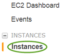

  You may see several instances

6. Enter your username in the filter field just below the **Launch Instance** button and hit enter

  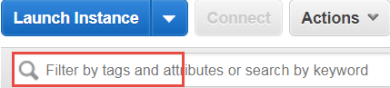

7. Making sure that your instance is selected, click on the **Actions > Instance State > Start**

  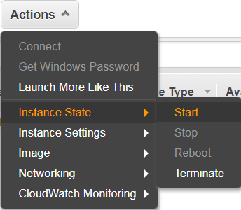

8. Wait for about 30 seconds and then click on the refresh button() to see the updated status to *running*

  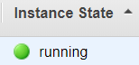

9. Make a note of the Public DNS and IPv4 Public IP which will be used by PuTTy and Remote Desktop (RDP)

  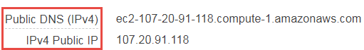

  **At this point you have three options to connect to AWS instance: RDP or NICE DCV for desktop like interface, and PuTTY for command line interface**

  **The instance provided to you has already been setup for RDP**

### Connect using RDP

**You can communicate with the instance using command line through PuTTY or Git Bash, and using GUI through remote desktop (RDP) connection.**

1. Start a remote desktop session

1. Enter the *IPv4* address

1. Click on the **Show Options**

  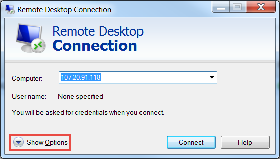

4. Select the **Display** tab and select *True Color (24 bit)* and click **Connect**

  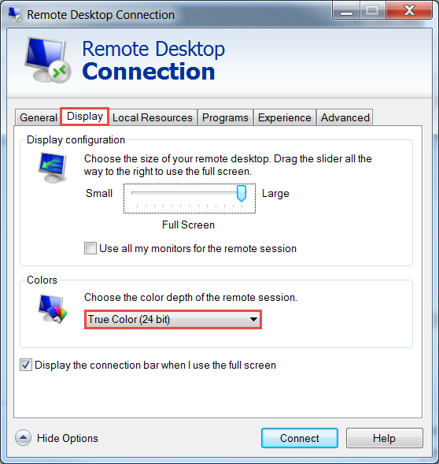

5. A certificate warning will be displayed. Click **Yes** to open the RDP session

6. Enter **centos** as the username and enter the provided password and click **OK**

  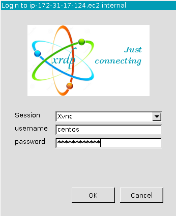

  **Continue to [Lab setup](#lab-setup)**

### Connecting to AWS instance using NICE DCV

NICE DCV as recommended by Amazon will be used to remote desktop to the instance.

* Download and install the appropriate NICE DCV client if necessary from here: https://download.nice-dcv.com

The NICE DCV session has already been started on the instance provided. See the Appendix for details on how to setup a session.

#### Start NICE DCV

* Open the NICE DCV application, enter the *IPv4 Public IP* from the Amazon console and click **Open**

  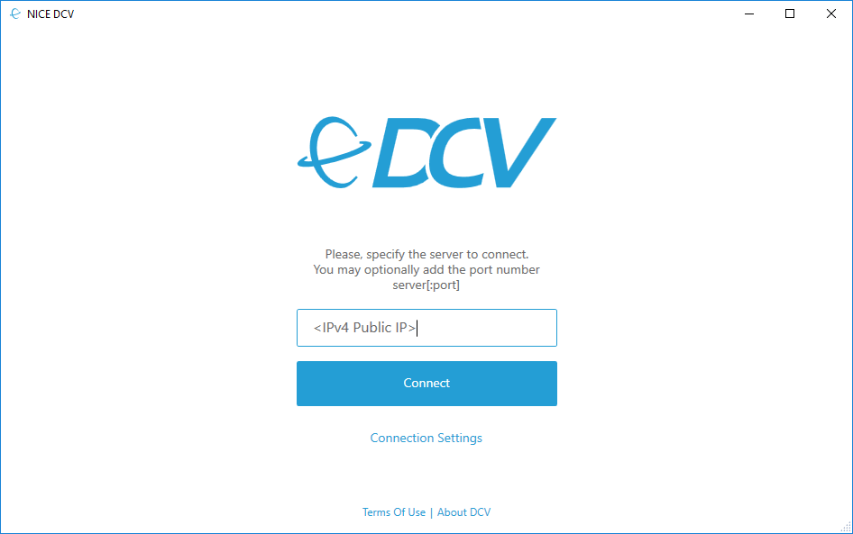

* When prompted, enter the username and password provided by your instructor to connect to the instance.

  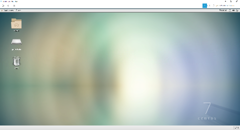

  **Continue to [Lab setup](#lab-setup)**

## Lab setup

1. Exectue the following to clone the *aws-fpga* repository and setup the Xilinx tools. `aws-fpga` includes the AWS F1 tools, HDK and documentation:

  ```sh
   cd ~
   git clone https://github.com/aws/aws-fpga
   cd ~/aws-fpga                                         
   source vitis_setup.sh
   source vitis_runtime_setup.sh
  ```

For more details see:

https://github.com/aws/aws-fpga/blob/master/Vitis/README.md

---------------------------------------

Proceed to the first lab [Introduction to Vitis](GUI_Flow_lab.md).

---------------------------------------

## Appendix

### Set up the NICE DCV session

1. Open PuTTY, enter the IPv4 Public IP address from the Amazon console, and click open

  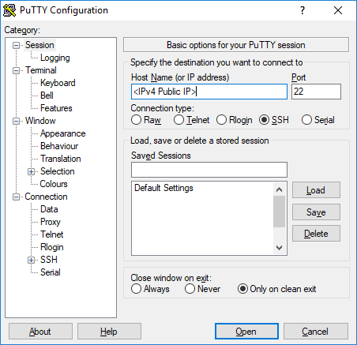

  This should open a terminal to the AWS instance.

1. In the terminal, enter the following command to start the DCV server:

  ```sh
  dcv create-session --type virtual --user centos centos
  ```

  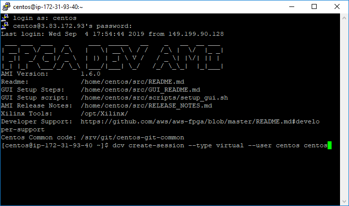

1. Stop the firewall

  ```sh
  sudo systemctl disable firewalld
  sudo systemctl stop firewalld
  ```

### Interacting with the Instance using Putty

1. Start **PuTTY** or your preferred SSH client

1. Enter *centos@<public\_dns\_entry>* in the **Host Name** field and **22** in the *Port* field  
  Make sure that SSH is selected as the Connection type

  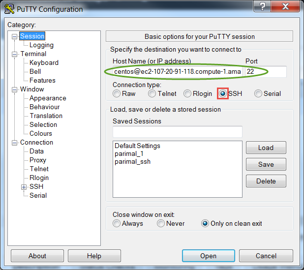

1. Expand **SSH** under the *Connection* in the left panel and click **Auth**

1. Click on the **Browse…** button, browse to where the private key has been stored  
  If you don&#39;t have the private key file (as in workshop) you can skip this step

1. Click **Open**

  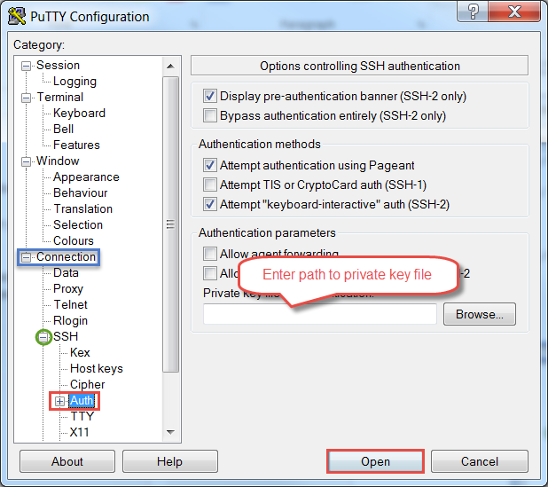

1. Click **Yes**.
  The PuTTY window will open. It will ask for the password (in case of the workshop). Enter the provided password

  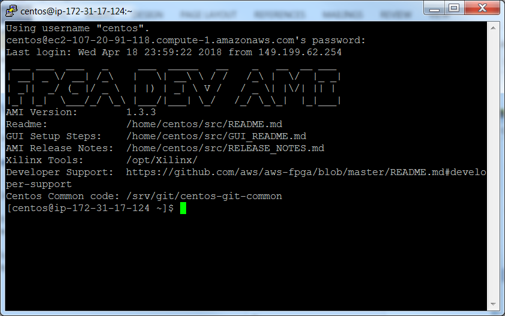

1. Set a password for the RDP connection with the following command

  ```sh
  sudo passwd <your choice of password>
  ```

  You will use the same password in the RDP connection.

1. Enter **exit** to close the session
